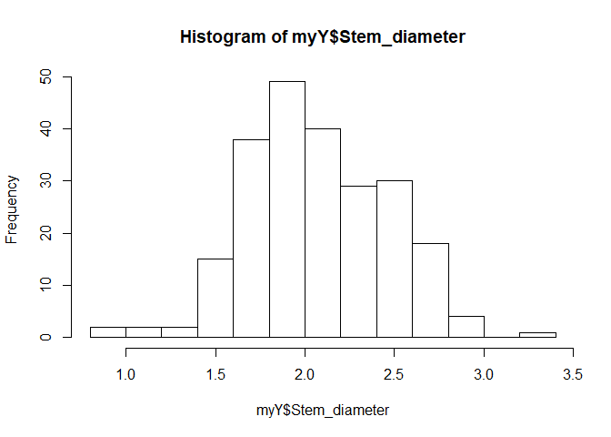
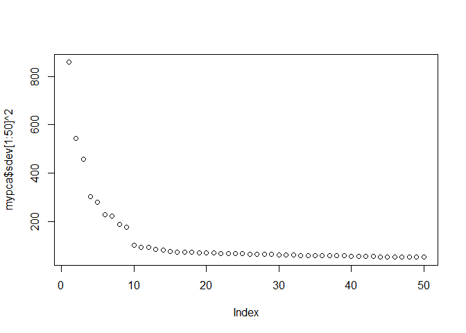
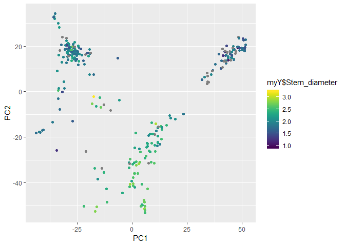
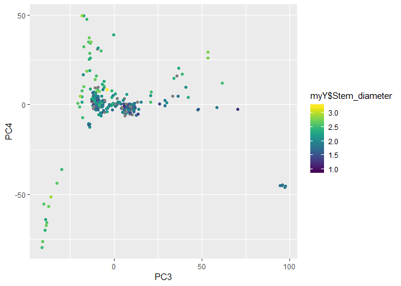
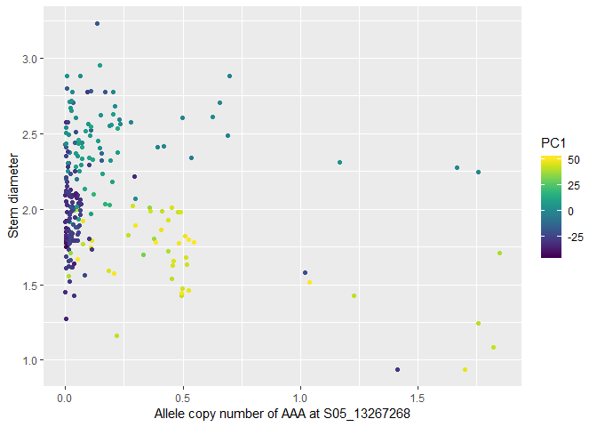

GWAS on tetraploid genotypes using GAPIT
================
Lindsay Clark
April 16, 2019

Packages needed to run GAPIT
----------------------------

Install the following packages if you don't have them already.

``` r
install.packages(c("gplots", "LDheatmap", "genetics", "ape", "EMMREML",
                   "scatterplot3d", "BiocManager", "ggplot2", "viridis"))
BiocManager::install("multtest")
```

Now we will load all of the packages as described in the [GAPIT manual](http://zzlab.net/GAPIT/gapit_help_document.pdf).

``` r
library(multtest)
library(gplots)
library(LDheatmap)
library(genetics)
library(ape)
library(EMMREML)
library(compiler) #this library is already installed in R
library(scatterplot3d)
```

And more for our own visualizations.

``` r
library(ggplot2)
library(viridis)
```

And finally load the source code with the GAPIT and EMMA functions.

``` r
source("http://zzlab.net/GAPIT/gapit_functions.txt")
source("http://zzlab.net/GAPIT/emma.txt")
```

Data for this tutorial
----------------------

Here we load the GAPIT files that were exported from polyRAD, containing posterior mean genotypes. See the [previous tutorial](polyRAD_diversity_panel.html) to understand how these were generated.

``` r
myGD <- read.csv("Msa_tetraploids_Chr05_GD.csv", stringsAsFactors = FALSE)
myGM <- read.csv("Msa_tetraploids_Chr05_GM.csv", stringsAsFactors = FALSE)

myGD[1:10,1:4]
```

    ##              taxa S05_51928_TTA S05_51928_TCC S05_51928_ATC
    ## 1         PMS-458  2.250853e-03  4.624893e-04    0.51356418
    ## 2  KMS-widespread  5.117938e-01  3.804286e-07    0.54778187
    ## 3      UI10-00117  4.479319e-02  1.716671e-02    0.05933096
    ## 4      UI11-00005  5.012321e-02  5.222333e-05    1.01539608
    ## 5      UI11-00027  1.163206e-04  6.286932e-02    0.13186265
    ## 6    IGR-2011-005  1.818289e-05  1.818315e-05    0.02728319
    ## 7         PMS-457  8.085649e-04  1.339165e-04    0.50462159
    ## 8           JY186  1.410903e-01  9.146026e-04    0.40938347
    ## 9           JY192  6.475757e-02  5.004677e-04    0.18882859
    ## 10          JY182  1.554136e-01  2.000000e-04    0.41823570

``` r
head(myGM)
```

    ##            Name Chromosome Position
    ## 1 S05_51928_TTA          5    51928
    ## 2 S05_51928_TCC          5    51928
    ## 3 S05_51928_ATC          5    51928
    ## 4  S05_81981_GG          5    81981
    ## 5  S05_81981_AC          5    81981
    ## 6 S05_132813_GC          5   132813

Next we will import some phenotypic data. The taxa are listed in the same order that they are in for the genotype file.

``` r
myY <- read.csv("Msa_tetraploids_pheno.csv", stringsAsFactors = FALSE)
```

The phenotypes file contains least-squared means, Box-Cox transformed, for stem diameter.

``` r
hist(myY$Stem_diameter)
```



``` r
sum(is.na(myY$Stem_diameter))
```

    ## [1] 38

Impact of population structure on the phenotype
-----------------------------------------------

GAPIT will perform a PCA, but we can also do the PCA ourselves to evaluate to what degree the phenotype is associated with population structure.

``` r
mypca <- prcomp(as.matrix(myGD[,-1]), scale. = TRUE)
```

We can plot the marker variance explained by each axis to get a sense of how many axes are biologically meaningful.

``` r
plot(mypca$sdev[1:50] ^ 2)
```



It looks like the first nine should suffice. Now we can see whether their association with the phenotype is significant.

``` r
pca_model <- lm(myY$Stem_diameter ~ mypca$x[,1:9])
summary(pca_model)
```

    ##
    ## Call:
    ## lm(formula = myY$Stem_diameter ~ mypca$x[, 1:9])
    ##
    ## Residuals:
    ##      Min       1Q   Median       3Q      Max
    ## -1.01787 -0.13323 -0.00425  0.14116  1.07171
    ##
    ## Coefficients:
    ##                     Estimate Std. Error t value Pr(>|t|)    
    ## (Intercept)        2.0462611  0.0173360 118.036  < 2e-16 ***
    ## mypca$x[, 1:9]PC1 -0.0025183  0.0006115  -4.118 5.41e-05 ***
    ## mypca$x[, 1:9]PC2 -0.0111238  0.0007219 -15.410  < 2e-16 ***
    ## mypca$x[, 1:9]PC3 -0.0052087  0.0007632  -6.825 8.43e-11 ***
    ## mypca$x[, 1:9]PC4  0.0023454  0.0009276   2.529   0.0122 *  
    ## mypca$x[, 1:9]PC5  0.0009586  0.0009692   0.989   0.3237    
    ## mypca$x[, 1:9]PC6  0.0001994  0.0011145   0.179   0.8582    
    ## mypca$x[, 1:9]PC7  0.0010986  0.0011355   0.967   0.3344    
    ## mypca$x[, 1:9]PC8  0.0003912  0.0017202   0.227   0.8203    
    ## mypca$x[, 1:9]PC9 -0.0011942  0.0012338  -0.968   0.3341    
    ## ---
    ## Signif. codes:  0 '***' 0.001 '**' 0.01 '*' 0.05 '.' 0.1 ' ' 1
    ##
    ## Residual standard error: 0.2604 on 220 degrees of freedom
    ##   (38 observations deleted due to missingness)
    ## Multiple R-squared:  0.581,  Adjusted R-squared:  0.5639
    ## F-statistic:  33.9 on 9 and 220 DF,  p-value: < 2.2e-16

Based on this, we want to use the first four PCs as covariates in GWAS. We can put them into a data frame.

``` r
myCV <- data.frame(Taxa = myY$Taxa,
                   PC1 = mypca$x[,1],
                   PC2 = mypca$x[,2],
                   PC3 = mypca$x[,3],
                   PC4 = mypca$x[,4])
```

We can also visualize how the axes are associated with the phenotype.

``` r
gp <- ggplot(myCV, aes(col = myY$Stem_diameter)) +
  scale_color_viridis()
gp + geom_point(aes(x = PC1, y = PC2))
```



``` r
gp + geom_point(aes(x = PC3, y = PC4))
```



Running GAPIT
-------------

GAPIT generates a lot of output files, so we will want to put them in a separate folder. Make a folder called `GAPIT_output` and then change your working directory to that one. Then we can run GAPIT.

``` r
setwd("GAPIT_output")
my_gapit <- GAPIT(Y = myY, GD = myGD, GM = myGM, CV = myCV)
setwd("..")
```

Evaluating the results
----------------------

Many files were output from GAPIT. If you open one of the manhattan plots, as well as the QQ plot, you should see that there was one highly significant marker. We can import the results table to find out which it was.

``` r
gwas_results <- read.csv("GAPIT_output/GAPIT.MLM.DBI.year3.BC.GWAS.Results.csv",
                         stringsAsFactors = FALSE)
head(gwas_results)
```

    ##             SNP Chromosome Position    P.value        maf nobs
    ## 1 S05_51928_ATC          1    51928 0.41298877 0.12328428  230
    ## 2 S05_51928_TCC          1    51928 0.59161215 0.03967660  230
    ## 3 S05_51928_TTA          1    51928 0.70552296 0.04533799  230
    ## 4  S05_81981_AC          1    81981 0.32211425 0.09000310  230
    ## 5  S05_81981_GG          1    81981 0.53008783 0.40364946  230
    ## 6 S05_132813_GC          1   132813 0.03273092 0.29255000  230
    ##   Rsquare.of.Model.without.SNP Rsquare.of.Model.with.SNP
    ## 1                    0.5274219                 0.5288100
    ## 2                    0.5274219                 0.5280176
    ## 3                    0.5274219                 0.5277173
    ## 4                    0.5274219                 0.5294538
    ## 5                    0.5274219                 0.5282379
    ## 6                    0.5274219                 0.5369475
    ##   FDR_Adjusted_P.values      effect
    ## 1             0.9747857  0.03585107
    ## 2             0.9921247 -0.04872719
    ## 3             0.9948205 -0.04753831
    ## 4             0.9680404 -0.03408207
    ## 5             0.9832450 -0.08948270
    ## 6             0.9153636 -0.11704214

``` r
gwas_results[gwas_results$FDR_Adjusted_P.values < 0.05, ]
```

    ##                   SNP Chromosome Position      P.value        maf nobs
    ## 2532 S05_13267268_AAA          1 13267268 5.125402e-08 0.04786535  230
    ##      Rsquare.of.Model.without.SNP Rsquare.of.Model.with.SNP
    ## 2532                    0.5274219                 0.5929617
    ##      FDR_Adjusted_P.values    effect
    ## 2532          0.0006749129 0.0418769

What was the relationship between this allele and the phenotype? We will multiply the genotype by two so that it scales from zero to four rather than zero to two, which will make it more intuitive in terms of allele copy number.

``` r
gp2 <- ggplot(mapping = aes(x = myGD$S05_13267268_AAA * 2,
                            y = myY$Stem_diameter)) +
  scale_color_viridis() +
  xlab("Allele copy number of AAA at S05_13267268") +
  ylab("Stem diameter")
gp2 + geom_point(aes(col = myCV$PC1)) + labs(col = "PC1")
```



We can see the three populations more or less by three color groups. Within each population, there seems to be a negative relationship between number of copies of this allele and stem diameter.

This visualization is helpful for understanding posterior mean genotypes and how they can be useful. The individuals clustered around zero on the x-axis probably have zero copies of the allele. At 0.5 on the x-axis, individuals have about a 50% chance of having one copy of the allele and a 50% chance of having zero copies. Since some of those individuals will have the allele and some won't, for the sake of linear regression it makes sense to have them positioned intermediate between zero and one.

Also notice that the three populations differ in terms of their median genotype value, even though the median is always less than 0.5 (*i.e* probably having zero copies). The allele is most common in the yellow/yellow-green population. Therefore, at low read depth, even if there were no reads for the allele, there is some probability that the individual has the allele, and that probability is higher than it is for the other populations. Likewise, the allele is rarest in the purple population, hence why the median genotype value for that population is much closer to zero.

If you have time, you can go back to the `RADdata` object for this marker and see how allelic read depth and genotype prior probabilities led to these posterior mean genotypes.
