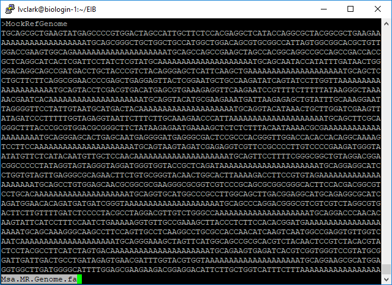
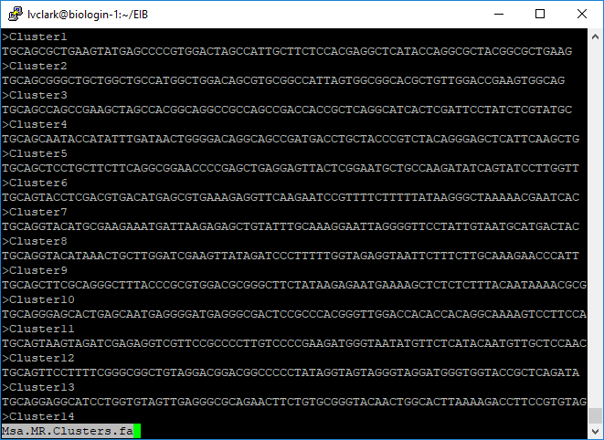
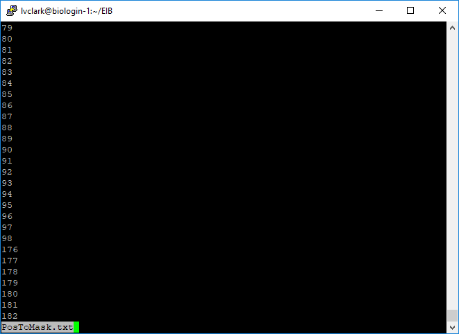
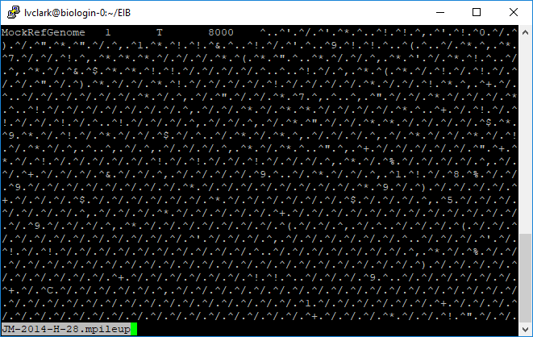
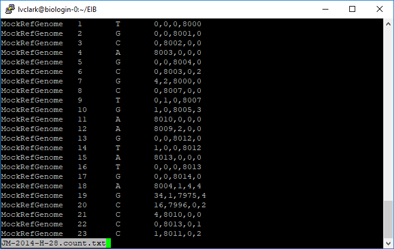
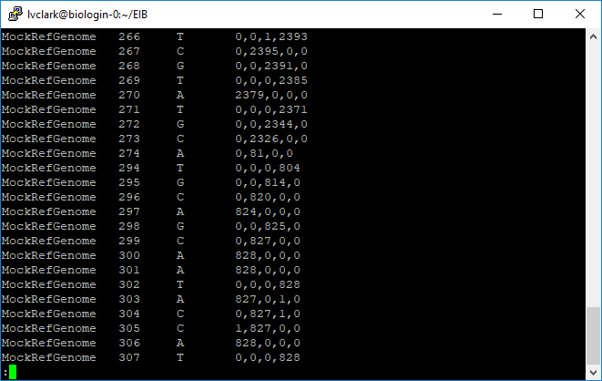
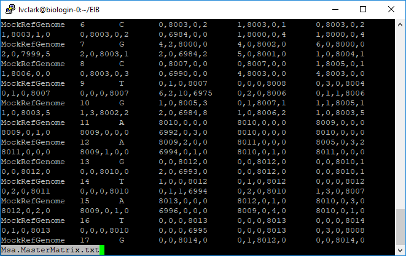
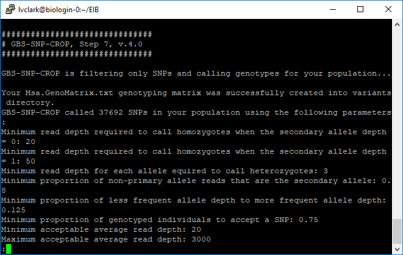
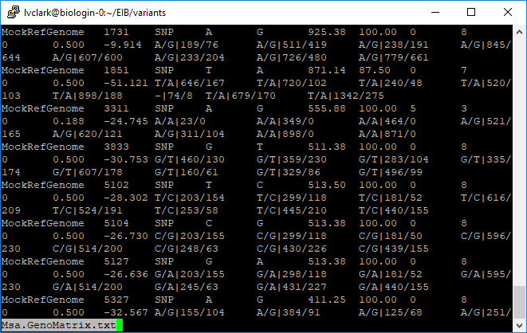
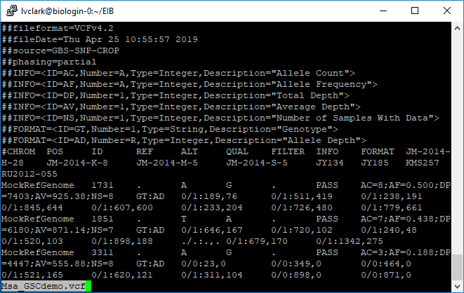

In this tutorial, I use [GBS-SNP-CROP](https://github.com/halelab/GBS-SNP-CROP)
to identify variants in a population of tetraploid individuals without a
reference genome, starting with the FASTQ files.  I then export the allelic
read depth to VCF for genotype calling downstream.

## Preparing the sequencing data

This section shows how I prepared the data for this tutorial.  I did it a little
differently from how you might, partly because my lab uses custom adapters and
partly because I only wanted to use a few samples in order to create a small
dataset that would process quickly.  You might instead follow the GBS-SNP-CROP
[tutorial](https://github.com/halelab/GBS-SNP-CROP/wiki/GBS-SNP-CROP-User-Manual-(v.4.0))
directly for your own data.

My RAD-seq library was sequenced using single-end reads on a HiSeq 4000, with
inline barcodes (*i.e.* the barcode is at the beginning of each read, followed
by the remainder of the restriction cut site).  There are many tools available
for demultiplexing such data, including
[Fastx Toolkit](http://hannonlab.cshl.edu/fastx_toolkit/),
[Stacks](http://catchenlab.life.illinois.edu/stacks/), and
[GBS-SNP-CROP](https://github.com/halelab/GBS-SNP-CROP).  I used my own software
[TagDigger](https://github.com/lvclark/tagdigger) because it has the custom
adapters that my lab uses built into it, and will trim them out while performing
the demultiplexing.  The CSV passed to the `-b` argument
lists input file, barcode, and output file for every sample.  The argument `-a`
indicates what adapter set was used.  TagDigger and all of the other tools
mentioned generate one FASTQ file for each barcode in the original file, with
the barcode sequence removed.

I ran the code below using Windows Command Prompt, but it would also work in bash.

``` bash
python barcode_splitter_script.py -b 190419remainingMsa_barcodekey_Hiseq4000.csv -a PstI-MspI-Clark
```

Out of the files that were generated, we will use the following ones for further
analysis.  These are all tetraploid, non-hybrid *Miscanthus sacchariflorus*
accessions.  If you wish to download the FASTQ files in order to reproduce this
entire tutorial, the run accession numbers on NCBI-SRA are provided.

| File                    | Sample       | Provenance  | SRA        |
|-------------------------|--------------|-------------|------------|
| DOEMsa56a_CCTCCAGA.fq   | JM-2014-H-28 | Japan       | SRR8997766 |
| DOEMsa56a_CCATAAG.fq    | JM-2014-K-8  | Japan       | SRR8997767	|
| DOEMsa56a_GGTGGCCA.fq   | JM-2014-M-5  | Japan       | SRR8997511 |
| DOEMsa56a_GCGGTCCA.fq   | JM-2014-S-5  | Japan       | SRR8997617 |
| DOEMsa56a_TTGTTGTCTA.fq | JY134        | China       | SRR8997716	|
| DOEMsa56a_CCACCATCAG.fq | JY185        | China       | SRR8997496 |
| DOEMsa56a_GGTGCCA.fq    | KMS257       | South Korea | SRR8997613 |
| DOEMsa56a_TTCTGACA.fq   | RU2012-055   | Russia      | SRR8991820 |

The sequences then need to all be trimmed to the same length, in particular
because the barcodes were variable length and we don't want to call SNPs at the
end of the read where there will be a lot of missing data.  We also want to get
rid of any low-quality base calls to reduce the number of sequencing errors
called as SNPs.
[Trimmomatic](http://www.usadellab.org/cms/?page=trimmomatic) can accomplish
this trimming, and we'll use it here also because it is what is used internally
by GBS-SNP-CROP.  We will trim the sequences to a maximum of 80 nucleotides,
then clip of low-quality sequence at the beginning or end, then discard reads
with fewer than 36 nucleotides.

Below is a bash script designed to run on a Linux cluster using Lmod to manage
software.  On your own Linux server, you might have to run
`java -jar /path/to/trimmomatic-0.38.jar` rather than just `trimmomatic`.

``` bash
#!/bin/bash

module load Trimmomatic

infiles=("DOEMsa56a_CCTCCAGA.fq" "DOEMsa56a_CCATAAG.fq"
         "DOEMsa56a_GGTGGCCA.fq" "DOEMsa56a_GCGGTCCA.fq"
         "DOEMsa56a_TTGTTGTCTA.fq" "DOEMsa56a_CCACCATCAG.fq"
         "DOEMsa56a_GGTGCCA.fq" "DOEMsa56a_TTCTGACA.fq")
outfiles=("JM-2014-H-28.R1.fq" "JM-2014-K-8.R1.fq"
          "JM-2014-M-5.R1.fq" "JM-2014-S-5.R1.fq"
          "JY134.R1.fq" "JY185.R1.fq" "KMS257.R1.fq" "RU2012-055.R1.fq")

for ((i=0;i<${#infiles[@]};++i)); do
    trimmomatic SE -threads 1 -phred64 ${infiles[i]} ${outfiles[i]} CROP:80 LEADING:3 TRAILING:3 MINLEN:36
done

gzip demultiplexed/*.R1.fq
```

The `gzip` line is necessary because GBS-SNP-CROP expects gzipped files.

## Assembling the mock reference

We'll make a tab-delimited text file, that we'll call `Msa_barcodes.txt`,
which will indicate the samples in this experiment.  The last column with `YES`
and `NO` indicates which samples to use for building the mock reference.  Two of
the files are smaller than the rest, which is why they are excluded.

```
CCTCCAGA	JM-2014-H-28	YES
CCATAAG	JM-2014-K-8	YES
GGTGGCCA	JM-2014-M-5	NO
GCGGTCCA	JM-2014-S-5	YES
TTGTTGTCTA	JY134	YES
CCACCATCAG	JY185	NO
GGTGCCA	KMS257	YES
TTCTGACA	RU2012-055	YES
```

Now we will use GBS-SNP-CROP to build the mock reference.

``` bash
#!/bin/bash

module load PEAR
module load VSEARCH
module load Perl

perl GBS-SNP-CROP-4.pl -pr pear -vs vsearch -d SE -b Msa_barcodes.txt -t 4 -rl 80 -MR Msa.MR
```

Again, we are loading `pear` and `vsearch` using Lmod, so we can use the program
names directly in place of specifying a path to them.  The argument `-d SE`
incidates that we have single end reads.  We will specify four processing cores
using `-t 4`, and that our reads are 80 nt long using `-rl 80`.  Finally, we
specify the file prefix for our mock reference genome using `-MR Msa.MR`.
("Msa" being an abbreviation that the Sacks lab commonly uses for
*Miscanthus sacchariflorus*.)

Once this is done running, there are some new files in your main directory,
including `Msa.MR.Genome.fa`, `Msa.MR.Clusters.fa`, and `PosToMask.txt`.
We can use `less` to inspect them.

``` bash
less Msa.MR.Genome.fa
```



`Msa.MR.Genome.fa` is what will be used as the reference genome when we align to Msa.
It contains all of the tag clusters separated using strings of `A` for spacers.

``` bash
less Msa.MR.Clusters.fa
```



`Msa.MR.Clusters.fa` isn't strictly needed for GBS-SNP-CROP, but is there in case
downstream software requires a reference genome.

``` bash
less PosToMask.txt
```



`PosToMask.txt` contains positions of all spacer nucleotides in `Msa.MR.Genome.fa`.

## Aligning reads to the mock reference and identifying SNPs

The next script in GBS-SNP-CROP uses the alignment software BWA to align every
sequence read to the mock reference that we just created.  It then uses SAMtools
to sort and index the alignments, then identify potential SNPs.  The `-q`, `-Q`,
`-f`, `-F`, and `-Opt` parameters get passed to SAMtools.

``` bash
#!/bin/bash

module load BWA
module load SAMtools
module load Perl

perl GBS-SNP-CROP-5.pl -bw bwa -st samtools -d SE -b Msa_barcodes.txt -ref Msa.MR.Genome.fa -Q 30 -q 0 -f 0 -F 2308 -t 4 -Opt 0
```

The most important output from this script is the set of files ending in
`.mpileup`, which contain information about how reads from each sample correspond
to alleles and loci.



At position 1 in the mock reference, where the reference base is a T, there were
8000 reads that aligned for JM-2014-H-28.  The rest of the information is not
particularly human-readable, however.

Another script then converts the information from the mpileup files into a
more readable format for further processing.  For the sake of having a smaller
dataset to look at in this tutorial, we will only look at SNPs and not indels
(`-p snp`).

``` bash
#!/bin/bash

module load Perl

perl GBS-SNP-CROP-6.pl -b Msa_barcodes.txt -out Msa.MasterMatrix.txt -p snp -t 4
```



Here we see how many reads corresponded to A, C, G, and T at each position.
Scrolling through the file we can see how depth varied from tag to tag.



Additionally, one file was created combining this information from all samples.



## Filtering markers

Now we will filter the markers and output them to a genotype matrix.  Although
GBS-SNP-CROP only makes diploid gentoype calls, which we will not be using, we
still want to tweak the parameters so that it can make these calls, because it
will throw out SNPs below a given call rate.  Here are all the parameters and
why I set them as I did:

* `-mnHoDepth0 20`: The default value of `5` assumes diploidy, where a
heterozygote will have alleles in a 1:1 ratio, so the probability of a genotype
with five reads having only reads of the first allele is 3%.  In tetraploids
we will frequently see a 3:1 ratio, so we would need twelve reads to have that
same 3% probability.  Since we seem to have pretty high depth in this dataset,
I increased the number from 12 to 20.
* `-mnHoDepth1 50`: When there is just one read of an allele, that read might
be due to contamination, or it might indicate a true heterozygote.  Again,
because we expect heterozygotes that are 3:1 rather than 1:1, we'll set a
higher threshold than the default for determining that a read represents
contamination.
* `-mnHetDepth 3`: I didn't see a particular reason to change this from the
default.  If we see at least three reads, we can start to believe that the
allele is really there.
* `-altStrength 0.8`: Another one that I kept at the default.  If there are
multiple alternative alleles, we want most of them to belong to one allele
so that GBS-SNP-CROP can convert it to a biallelic marker.
* `-mnAlleleRatio 0.125`: This is used for catching paralogous loci that
were collapsed into single loci.  In a diploid system, we expect a depth
ratio of 0.5, but because it can vary due to random chance, the default is to
allow it to be as low as 0.25.  Since we have a tetraploid and are expecting
0.25, I'll lower it to 0.125 to allow sampling error.  If we see allele depth
ratios much below that, it could indicate that a locus isn't really just one
locus.
* `-mnCall 0.75`: The default is fine; wanting 75% of samples to have calls for
a given SNP is typical.
* `-mnAvgDepth 20 `: Since we have very high depth, we will set this value higher
than the default of `3`.
* `-mxAvgDepth 3000`: Since we have very high depth, we will set this value
higher than the default of `200`.

``` bash
#!/bin/bash

module load Perl

perl GBS-SNP-CROP-7.pl -in Msa.MasterMatrix.txt -out Msa.GenoMatrix.txt -p snp -mnHoDepth0 20 -mnHoDepth1 50 -mnHetDepth 3 -altStrength 0.8 -mnAlleleRatio 0.125 -mnCall 0.75 -mnAvgDepth 20 -mxAvgDepth 3000
```

We can see a log of what happened, showing that we got almost 38K SNPs.



This is what the output genotype matrix looks like.  It contains genotype calls
and allelic read depth.



## Exporting to VCF

Finally, we'll convert the genotype matrix to a VCF.

``` bash
#!/bin/bash

module load Perl

perl GBS-SNP-CROP-8.pl -in variants/Msa.GenoMatrix.txt -out Msa_GSCdemo -b Msa_barcodes.txt -formats vcf
```



This is the file that we will keep and use for further analysis with other software.
