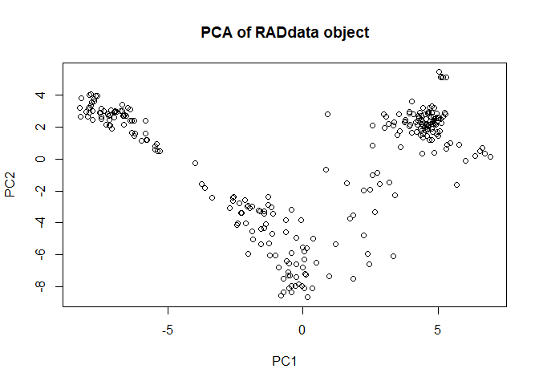
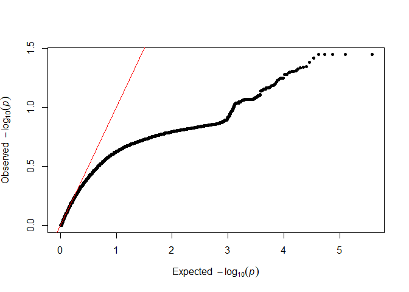
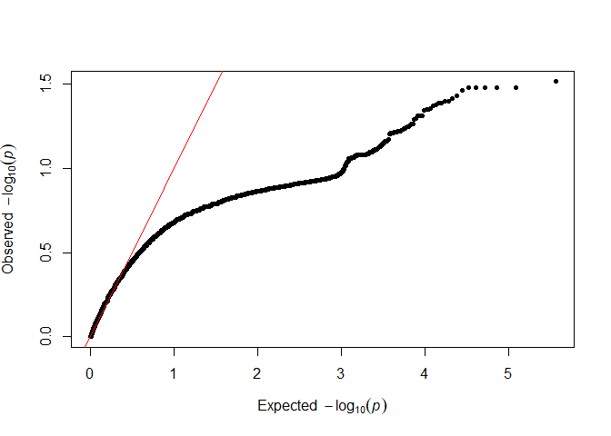
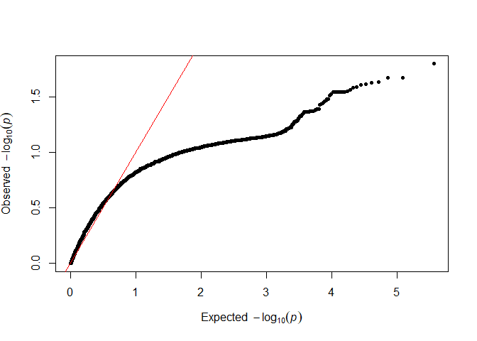
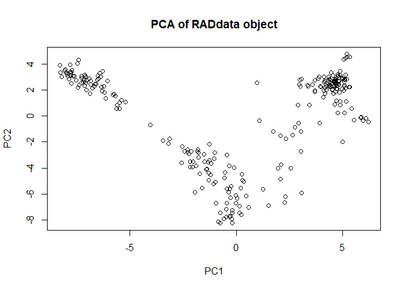

Packages for this tutorial
--------------------------

If you don't already have the following packages, install them:

``` r
CRAN_packages <- c("polyRAD", "BiocManager", "qqman")
Bioconductor_packages <- c("pcaMethods", "VariantAnnotation")

BiocManager::install(Bioconductor_packages)
install.packages(CRAN_packages)
```

Then load them into your R workspace:

``` r
library(polyRAD)
library(VariantAnnotation)
library(qqman)
```

As another quick setup item, I'll set the seed for random number generation to ensure that your results are identical to mine.

``` r
set.seed(50819)
```

Import the VCF
--------------

The VCF for this tutorial was generated by the [GBSv2](https://bitbucket.org/tasseladmin/tassel-5-source/wiki/Tassel5GBSv2Pipeline) pipeline in TASSEL 5. A large diversity panel of *Miscanthus sacchariflorus* was sequenced using a RAD-seq approach with the enzymes *Pst*I and *Msp*I. To make a file small enough for this tutorial, [VariantAnnotation](http://bioconductor.org/packages/release/bioc/html/VariantAnnotation.html) was used to filter the dataset by missing data rate and minor allele frequency, as well as subset it to only contain tetraploid individuals, and only SNPs on chromosome 5. The *Miscanthus sinensis* v7 reference from Phytozome was used.

We can get some basic information about the VCF, including the names of the 268 samples:

``` r
vcf_file <- "Msa_tetraploids_Chr05.vcf.bgz"
hdr <- scanVcfHeader(vcf_file)
hdr
```

    ## class: VCFHeader
    ## samples(268): PMS-458 KMS-widespread ... KMS410 JM2014-H-7
    ## meta(4): fileDate fileformat Tassel contig
    ## fixed(1): FILTER
    ## info(3): NS DP AF
    ## geno(5): GT AD DP GQ PL

``` r
samples(hdr)
```

    ##   [1] "PMS-458"         "KMS-widespread"  "UI10-00117"     
    ##   [4] "UI11-00005"      "UI11-00027"      "IGR-2011-005"   
    ##   [7] "PMS-457"         "JY186"           "JY192"          
    ##  [10] "JY182"           "JY009"           "KMS408"         
    ##  [13] "JY008"           "JY127"           "KMS417"         
    ##  [16] "JY006"           "JY129"           "JM2014-S-3"     
    ##  [19] "JM2014-M-3"      "JY183"           "JM2014-M-4"     
    ##  [22] "JY178"           "JM2014-H-68"     "JM2014-H-11"    
    ##  [25] "JM2014-H-41"     "JPN-2010-009"    "JY172"          
    ##  [28] "JMShiraN24"      "JY193"           "JY143"          
    ##  [31] "JPN-2010-014"    "KMS419"          "JY176"          
    ##  [34] "JM2014-H-67"     "JM2014-H-72"     "JM2014-M-14"    
    ##  [37] "JPN-2010-004"    "JM2014-K-8"      "JY141"          
    ##  [40] "JPN-2011-012"    "JPN-2011-004"    "JM11-037"       
    ##  [43] "JY185"           "JM2014-H-24"     "JPN-2011-019"   
    ##  [46] "JY168"           "JY166"           "KMS423"         
    ##  [49] "UI11-00007"      "UI11-00032"      "JPN-2011-001"   
    ##  [52] "JM1N24"          "JM2014-H-23"     "JPN-2011-023"   
    ##  [55] "JMMiyakonojoFSC" "JPN-2010-001"    "UI11-00039"     
    ##  [58] "JY165"           "JM2014-H-52"     "JY179"          
    ##  [61] "JM2014-H-28"     "KMS351"          "KMS268"         
    ##  [64] "JM2014-H-30"     "JPN-2010-008"    "KMS263"         
    ##  [67] "KMS262"          "JPN-2011-020"    "JM2014-H-58"    
    ##  [70] "JY162"           "JM2014-S-6"      "JY171"          
    ##  [73] "KMS446"          "JM2014-H-48"     "JPN-2011-003"   
    ##  [76] "KMS422"          "JY126"           "KMS451"         
    ##  [79] "KMS329"          "KMS468"          "KMS400"         
    ##  [82] "JM11-013"        "JY134"           "JPN-2011-013"   
    ##  [85] "JM11-027"        "JM2014-K-7"      "KMS405"         
    ##  [88] "JM2014-H-69"     "JPN-2010-002"    "JM2014-H-13"    
    ##  [91] "JM11-019"        "JPN-2010-012"    "RU2012-055"     
    ##  [94] "JM2014-H-42"     "JPN-2010-010"    "JPN-2011-011"   
    ##  [97] "JM2014-H-77"     "JPN-2011-025"    "JPN-2010-005"   
    ## [100] "JMKikuchi1N24"   "JM2014-M-5"      "JM2014-H-27"    
    ## [103] "JM2014-H-25"     "KMS448"          "JM2014-S-2"     
    ## [106] "KMS399"          "KMS257"          "JM2014-S-5"     
    ## [109] "JPN-2011-002"    "JM2014-H-22"     "RU2012-023"     
    ## [112] "JPN-2011-022"    "UI11-00037"      "KMS324"         
    ## [115] "JM2014-H-19"     "JM2014-M-7"      "JPN-2010-015"   
    ## [118] "JM2014-H-3"      "JM2014-M-2"      "JM2014-H-44"    
    ## [121] "JY173"           "JY140"           "JM2014-H-16"    
    ## [124] "JPN-2011-014"    "JM11-040"        "JM2014-H-29"    
    ## [127] "JM2014-H-71"     "KMS467"          "JPN-2011-010"   
    ## [130] "JM2014-K-4"      "JM11-006"        "KMS347"         
    ## [133] "JPN-2011-015"    "JY177"           "KMS278"         
    ## [136] "JPN-2010-007"    "JM2014-H-51"     "JY010"          
    ## [139] "JM2014-K-13"     "JPN-2011-005"    "JM2014-H-70"    
    ## [142] "JM2014-H-66"     "KMS450"          "KMS412"         
    ## [145] "JM2014-H-43"     "KMS453"          "KMS435"         
    ## [148] "JM2014-H-26"     "KMS392"          "KMS319"         
    ## [151] "JM2014-H-18"     "KMS444"          "JY137"          
    ## [154] "JM2014-M-12"     "JPN-2011-008"    "JPN-2010-006"   
    ## [157] "JPN-2010-003"    "JM2014-H-12"     "JM2014-S-1"     
    ## [160] "JPN-2010-013"    "JM2014-H-55"     "UI11-00033"     
    ## [163] "JM2014-H-47"     "UI11-00035"      "JPN-2011-016"   
    ## [166] "JM2014-H-46"     "UI11-00036"      "JPN-2011-017"   
    ## [169] "JM2014-H-78"     "KMS407"          "KMS341"         
    ## [172] "KMS345"          "JM2014-H-76"     "JPN-2011-006"   
    ## [175] "KMS427"          "JM2014-H-73"     "KMS452"         
    ## [178] "JM2014-K-15"     "JM2014-H-14"     "JPN-2010-011"   
    ## [181] "KMS395"          "KMS253"          "JM2014-H-63"    
    ## [184] "JM2014-H-10"     "JM2014-K-2"      "JY013"          
    ## [187] "JY159"           "JM2014-H-4"      "JM11-002"       
    ## [190] "KMS316"          "UI11-00038"      "KMS420"         
    ## [193] "JM2014-K-5"      "KMS413"          "JM2014-H-5"     
    ## [196] "KMS430"          "JM2014-H-75"     "JM2014-M-9"     
    ## [199] "JPN-2011-018"    "JM2014-H-20"     "JM2014-H-50"    
    ## [202] "JM2014-H-57"     "KMS330"          "KMS403"         
    ## [205] "JM2014-H-62"     "KMS354"          "KMS348"         
    ## [208] "JM2014-K-6"      "JM2014-H-2"      "KMS418"         
    ## [211] "JM2014-K-11"     "JM2014-H-8"      "KMS380"         
    ## [214] "JM2014-H-64"     "KMS449"          "KMS328"         
    ## [217] "KMS414"          "JM2014-H-56"     "JM2014-M-11"    
    ## [220] "JM2014-K-10"     "JY118-1"         "JY174"          
    ## [223] "JY152"           "JY191"           "KMS415"         
    ## [226] "JY175"           "JM2014-H-9"      "JM2014-M-1"     
    ## [229] "JM2014-H-54"     "JM2014-H-49"     "JY138"          
    ## [232] "KMS390"          "KMS465"          "KMS346"         
    ## [235] "KMS332"          "KMS402"          "KMS411"         
    ## [238] "JMNaganumaFSC"   "JM2014-H-6"      "JM11-024-1"     
    ## [241] "JM11-024-2"      "RU2012-056.1"    "UI11-00034"     
    ## [244] "KMS393"          "KMS397"          "JM2014-H-45"    
    ## [247] "KMS275"          "KMS409"          "JM2014-H-53"    
    ## [250] "JM2014-H-60"     "JY136"           "JY146"          
    ## [253] "JY149"           "KMS434-47"       "KMS437"         
    ## [256] "JM2014-M-6"      "JM2014-M-10"     "JM2014-M-13"    
    ## [259] "KMS352"          "JMKamishoN24"    "JMTomatoN24"    
    ## [262] "JM2014-H-21"     "KMS387"          "JY144"          
    ## [265] "KMS340"          "KMS342"          "KMS410"         
    ## [268] "JM2014-H-7"

The VCF can be imported into a `RADdata` object for genotype calling in polyRAD. There can be a lot of missing data using RAD-seq, so we'll set the filtering threshold to only retain markers where at least 140 individuals (slightly more than half) have non-missing data. We'll also say that we want at least five individuals to have the minor allele, in order to prevent false positives that can result from individuals with extreme phenotypes being the only ones to posess a rare allele. Using the `possiblePloidies` argument, we will indicate that the organism is autotetraploid. Since I know that this is a small dataset, I am also setting `expectedAlleles` and `expectedLoci` below their default values to save computation time and memory.

``` r
myRAD <- VCF2RADdata(vcf_file,
                     min.ind.with.reads = 140,
                     min.ind.with.minor.allele = 5,
                     possiblePloidies = list(4),
                     expectedAlleles = 5e4,
                     expectedLoci = 2e4)
```

    ## Reading file...

    ## Unpacking data from VCF...

    ## Filtering markers...

    ## Phasing 4268 SNPs on chromosome 05

    ## Reading file...

    ## Unpacking data from VCF...

    ## Filtering markers...

    ## Phasing 4333 SNPs on chromosome 05

    ## Reading file...

    ## Unpacking data from VCF...

    ## Filtering markers...

    ## Phasing 4322 SNPs on chromosome 05

    ## Reading file...

    ## Unpacking data from VCF...

    ## Filtering markers...

    ## Phasing 883 SNPs on chromosome 05

    ## Reading file...

    ## 5097 loci imported.

    ## Building RADdata object...

    ## Merging rare haplotypes...

    ## 5097 markers retained out of 5097 originally.

``` r
myRAD
```

    ## ## RADdata object ##
    ## 268 taxa and 5097 loci
    ## 54160327 total reads
    ## Assumed sample cross-contamination rate of 0.001
    ##
    ## Possible ploidies:
    ## Autotetraploid (4)

We can see that we imported 5097 loci. The default behavior of `VCF2RADdata` is also to phase SNPs that appeared to originate from the same tag location, assuming a reduced-representation sequencing technique. This means that for many loci, we will have multiallelic haplotype-based markers rather than biallelic SNPs. The following code gives us a sense of how many alleles per locus we tend to have.

``` r
table(table(myRAD$alleles2loc))
```

    ##
    ##    2    3    4    5    6    7    8    9   10   11   12   13   15   16   17
    ## 1829 1230  844  536  289  168   85   47   33    9    9    4    2    2    1
    ##   19   20   21
    ##    3    3    3

Most markers are biallelic or triallelic, but there are many with more alleles.

We can also get a quick picture of population structure.

``` r
myRAD <- AddPCA(myRAD)
plot(myRAD)
```



There appear to be three major groups, which makes sense given [previous findings](https://doi.org/10.1093/aob/mcy161) indicating mainland Asian tetraploids, S Japan tetraploids, and N Japan tetraploids being distinct populations. We can see which individuals are in which group.

``` r
sort(GetTaxa(myRAD)[myRAD$PCA[,1] < -5]) # N Japan
```

    ##  [1] "JM1N24"        "JM2014-H-10"   "JM2014-H-12"   "JM2014-H-13"  
    ##  [5] "JM2014-H-14"   "JM2014-H-18"   "JM2014-H-19"   "JM2014-H-2"   
    ##  [9] "JM2014-H-20"   "JM2014-H-21"   "JM2014-H-22"   "JM2014-H-23"  
    ## [13] "JM2014-H-24"   "JM2014-H-25"   "JM2014-H-26"   "JM2014-H-27"  
    ## [17] "JM2014-H-28"   "JM2014-H-29"   "JM2014-H-3"    "JM2014-H-30"  
    ## [21] "JM2014-H-4"    "JM2014-H-41"   "JM2014-H-42"   "JM2014-H-43"  
    ## [25] "JM2014-H-44"   "JM2014-H-45"   "JM2014-H-46"   "JM2014-H-47"  
    ## [29] "JM2014-H-48"   "JM2014-H-49"   "JM2014-H-5"    "JM2014-H-50"  
    ## [33] "JM2014-H-51"   "JM2014-H-52"   "JM2014-H-53"   "JM2014-H-54"  
    ## [37] "JM2014-H-55"   "JM2014-H-56"   "JM2014-H-57"   "JM2014-H-58"  
    ## [41] "JM2014-H-6"    "JM2014-H-60"   "JM2014-H-62"   "JM2014-H-63"  
    ## [45] "JM2014-H-66"   "JM2014-H-67"   "JM2014-H-68"   "JM2014-H-69"  
    ## [49] "JM2014-H-7"    "JM2014-H-70"   "JM2014-H-71"   "JM2014-H-72"  
    ## [53] "JM2014-H-73"   "JM2014-H-75"   "JM2014-H-76"   "JM2014-H-77"  
    ## [57] "JM2014-H-78"   "JM2014-H-8"    "JM2014-H-9"    "JMKamishoN24"
    ## [61] "JMNaganumaFSC" "JMTomatoN24"   "JPN-2010-003"  "JPN-2010-005"
    ## [65] "JPN-2011-008"  "JPN-2011-010"

``` r
sort(GetTaxa(myRAD)[myRAD$PCA[,1] > -5 & myRAD$PCA[,1] < 1]) # S Japan
```

    ##  [1] "IGR-2011-005"    "JM11-027"        "JM11-040"       
    ##  [4] "JM2014-H-11"     "JM2014-H-64"     "JM2014-K-10"    
    ##  [7] "JM2014-K-11"     "JM2014-K-13"     "JM2014-K-15"    
    ## [10] "JM2014-K-2"      "JM2014-K-4"      "JM2014-K-5"     
    ## [13] "JM2014-K-8"      "JM2014-M-1"      "JM2014-M-10"    
    ## [16] "JM2014-M-11"     "JM2014-M-12"     "JM2014-M-13"    
    ## [19] "JM2014-M-14"     "JM2014-M-2"      "JM2014-M-3"     
    ## [22] "JM2014-M-4"      "JM2014-M-5"      "JM2014-M-6"     
    ## [25] "JM2014-M-7"      "JM2014-M-9"      "JM2014-S-1"     
    ## [28] "JM2014-S-5"      "JM2014-S-6"      "JMKikuchi1N24"  
    ## [31] "JMMiyakonojoFSC" "JMShiraN24"      "JPN-2010-001"   
    ## [34] "JPN-2010-002"    "JPN-2010-004"    "JPN-2010-006"   
    ## [37] "JPN-2010-007"    "JPN-2010-008"    "JPN-2010-009"   
    ## [40] "JPN-2010-010"    "JPN-2010-011"    "JPN-2010-012"   
    ## [43] "JPN-2010-013"    "JPN-2010-014"    "JPN-2010-015"   
    ## [46] "JPN-2011-001"    "JPN-2011-002"    "JPN-2011-003"   
    ## [49] "JPN-2011-004"    "JPN-2011-005"    "JPN-2011-006"   
    ## [52] "JPN-2011-011"    "JPN-2011-012"    "JPN-2011-013"   
    ## [55] "JPN-2011-014"    "JPN-2011-015"    "JPN-2011-016"   
    ## [58] "JPN-2011-017"    "JPN-2011-018"    "JPN-2011-019"   
    ## [61] "JPN-2011-020"    "JPN-2011-022"    "JPN-2011-023"   
    ## [64] "JPN-2011-025"    "UI10-00117"      "UI11-00005"     
    ## [67] "UI11-00007"      "UI11-00027"      "UI11-00032"     
    ## [70] "UI11-00033"      "UI11-00034"      "UI11-00035"     
    ## [73] "UI11-00036"      "UI11-00037"      "UI11-00038"     
    ## [76] "UI11-00039"

``` r
sort(GetTaxa(myRAD)[myRAD$PCA[,1] > 1]) # mainland and a few from Japan
```

    ##   [1] "JM11-002"       "JM11-006"       "JM11-013"       "JM11-019"      
    ##   [5] "JM11-024-1"     "JM11-024-2"     "JM11-037"       "JM2014-H-16"   
    ##   [9] "JM2014-K-6"     "JM2014-K-7"     "JM2014-S-2"     "JM2014-S-3"    
    ##  [13] "JY006"          "JY008"          "JY009"          "JY010"         
    ##  [17] "JY013"          "JY118-1"        "JY126"          "JY127"         
    ##  [21] "JY129"          "JY134"          "JY136"          "JY137"         
    ##  [25] "JY138"          "JY140"          "JY141"          "JY143"         
    ##  [29] "JY144"          "JY146"          "JY149"          "JY152"         
    ##  [33] "JY159"          "JY162"          "JY165"          "JY166"         
    ##  [37] "JY168"          "JY171"          "JY172"          "JY173"         
    ##  [41] "JY174"          "JY175"          "JY176"          "JY177"         
    ##  [45] "JY178"          "JY179"          "JY182"          "JY183"         
    ##  [49] "JY185"          "JY186"          "JY191"          "JY192"         
    ##  [53] "JY193"          "KMS-widespread" "KMS253"         "KMS257"        
    ##  [57] "KMS262"         "KMS263"         "KMS268"         "KMS275"        
    ##  [61] "KMS278"         "KMS316"         "KMS319"         "KMS324"        
    ##  [65] "KMS328"         "KMS329"         "KMS330"         "KMS332"        
    ##  [69] "KMS340"         "KMS341"         "KMS342"         "KMS345"        
    ##  [73] "KMS346"         "KMS347"         "KMS348"         "KMS351"        
    ##  [77] "KMS352"         "KMS354"         "KMS380"         "KMS387"        
    ##  [81] "KMS390"         "KMS392"         "KMS393"         "KMS395"        
    ##  [85] "KMS397"         "KMS399"         "KMS400"         "KMS402"        
    ##  [89] "KMS403"         "KMS405"         "KMS407"         "KMS408"        
    ##  [93] "KMS409"         "KMS410"         "KMS411"         "KMS412"        
    ##  [97] "KMS413"         "KMS414"         "KMS415"         "KMS417"        
    ## [101] "KMS418"         "KMS419"         "KMS420"         "KMS422"        
    ## [105] "KMS423"         "KMS427"         "KMS430"         "KMS434-47"     
    ## [109] "KMS435"         "KMS437"         "KMS444"         "KMS446"        
    ## [113] "KMS448"         "KMS449"         "KMS450"         "KMS451"        
    ## [117] "KMS452"         "KMS453"         "KMS465"         "KMS467"        
    ## [121] "KMS468"         "PMS-457"        "PMS-458"        "RU2012-023"    
    ## [125] "RU2012-055"     "RU2012-056.1"

Preliminary genotype calling and estimation of overdispersion
-------------------------------------------------------------

We will do a quick genotype estimation so that we can test how overdispersed the distribution of sequencing reads is. We may want to adjust the model if it seems like read depth diverges very far from the expected ratios.

``` r
myRAD_pre <- IterateHWE(myRAD, tol = 0.001)
```

    ## Starting iteration 1

    ## Mean difference in allele frequencies of 0.00774877963203997

    ## Starting iteration 2

    ## Mean difference in allele frequencies of 0.00212604559575315

    ## Starting iteration 3

    ## Mean difference in allele frequencies of 0.000878928453068841

``` r
testod <- TestOverdispersion(myRAD_pre, to_test = 7:11)
```

The we can visualize the overdispersion results.

``` r
qq(testod[["7"]])
```



``` r
qq(testod[["8"]])
```



``` r
qq(testod[["9"]])
```


``` r
qq(testod[["10"]])
```


``` r
qq(testod[["11"]])
```



It seems that the dots follow the red line most closely for 8 and 9, so we will keep the default of `overdispersion = 9`. The lower the value that we choose, the messier the data are assumed to be.

Calling the genotypes
---------------------

Now we will use the population structure pipeline to call the genotypes, since we know there is population structure. *Miscanthus* are wild, outcrossing grasses with very little linkage disequilibrium, so we will use the model without linkage disequilibrium.

``` r
myRAD <- IteratePopStruct(myRAD)
```

    ## Performing initial PCA and allele frequency estimation.

    ## Starting iteration 1

    ## PCs used: 4

    ## Mean difference in allele frequencies of 0.0110771855801767

    ## Starting iteration 2

    ## PCs used: 5

    ## Mean difference in allele frequencies of 0.0076788298312621

    ## Starting iteration 3

    ## PCs used: 6

    ## Mean difference in allele frequencies of 0.00728463433866155

    ## Starting iteration 4

    ## PCs used: 7

    ## Mean difference in allele frequencies of 0.00518479027794337

    ## Starting iteration 5

    ## PCs used: 8

    ## Mean difference in allele frequencies of 0.00476464299499636

    ## Starting iteration 6

    ## PCs used: 9

    ## Mean difference in allele frequencies of 0.00188961685124673

    ## Starting iteration 7

    ## PCs used: 9

    ## Mean difference in allele frequencies of 0.00112218001790855

    ## Starting iteration 8

    ## PCs used: 9

    ## Mean difference in allele frequencies of 0.000792682568668029

We can plot population structure again and see that it has tightened up now that we have estimated allele dosage more accurately.

``` r
plot(myRAD)
```



Exploring the results
---------------------

We can look at the allele depth matrix, and see that the first four alleles belong to the same locus.

``` r
myRAD$alleleDepth[1:10,1:5]
```

    ##                S05_51928_TTC S05_51928_TTA S05_51928_TCC S05_51928_ATC
    ## PMS-458                   35             0             0             4
    ## KMS-widespread            62            25             0            25
    ## UI10-00117                 5             0             0             0
    ## UI11-00005                 0             0             0             6
    ## UI11-00027                 2             0             0             0
    ## IGR-2011-005              14             0             0             0
    ## PMS-457                   62             0             0             5
    ## JY186                      0             0             0             0
    ## JY192                      3             0             0             0
    ## JY182                      0             0             0             0
    ##                S05_81981_GC
    ## PMS-458                  13
    ## KMS-widespread           20
    ## UI10-00117                2
    ## UI11-00005                0
    ## UI11-00027                0
    ## IGR-2011-005              1
    ## PMS-457                  24
    ## JY186                     0
    ## JY192                     0
    ## JY182                     2

polyRAD not only estimated the overall frequency of these alleles in the population, but also the frequency in the local subpopulation that each individual originated from.

``` r
myRAD$alleleFreq[1:4]
```

    ## S05_51928_TTC S05_51928_TTA S05_51928_TCC S05_51928_ATC
    ##    0.79352144    0.04363243    0.03595037    0.11726594

``` r
myRAD$alleleFreqByTaxa[1:10,1:4]
```

    ##                S05_51928_TTC S05_51928_TTA S05_51928_TCC S05_51928_ATC
    ## PMS-458            0.7009366    0.06689353  0.0149683629    0.21720151
    ## KMS-widespread     0.7275313    0.05904669  0.0001000000    0.21332200
    ## UI10-00117         0.8117656    0.06977349  0.0272840775    0.09117678
    ## UI11-00005         0.8105773    0.09030955  0.0001000000    0.09901317
    ## UI11-00027         0.8334041    0.00010000  0.0541324680    0.11236340
    ## IGR-2011-005       0.8649998    0.00010000  0.0001000000    0.13480015
    ## PMS-457            0.6992147    0.06920085  0.0124894197    0.21909507
    ## JY186              0.7239559    0.07083529  0.0005745996    0.20463421
    ## JY192              0.7360167    0.06884988  0.0001000000    0.19503338
    ## JY182              0.7129562    0.07785057  0.0001000000    0.20909326

These local allele frequencies were used for estimating local genotype frequencies under Hardy-Weinberg equilibrium (although we could have also specified a self-fertilization rate).

``` r
myRAD$priorProb[[1]][,1:5,1:4]
```

    ## , , S05_51928_TTC
    ##
    ##      PMS-458 KMS-widespread  UI10-00117  UI11-00005   UI11-00027
    ## 0 0.00781727    0.005525035 0.001279212 0.001345205 0.0007583654
    ## 1 0.07389110    0.058960734 0.021939358 0.022715621 0.0152462297
    ## 2 0.26191504    0.235951078 0.141103098 0.143844112 0.1149417231
    ## 3 0.41261614    0.419660921 0.403335705 0.404834056 0.3851327316
    ## 4 0.24376046    0.279902232 0.432342628 0.427261005 0.4839209502
    ##
    ## , , S05_51928_TTA
    ##
    ##        PMS-458 KMS-widespread   UI10-00117   UI11-00005   UI11-00027
    ## 0 7.604873e-01   7.827834e-01 7.481228e-01 6.804546e-01 9.996001e-01
    ## 1 2.155099e-01   1.976932e-01 2.251651e-01 2.749926e-01 3.998800e-04
    ## 2 2.290201e-02   1.872290e-02 2.541328e-02 4.167487e-02 5.998800e-08
    ## 3 1.081677e-03   7.880833e-04 1.274787e-03 2.807017e-03 3.999600e-12
    ## 4 1.915812e-05   1.243948e-05 2.397983e-05 7.090012e-05 1.000000e-16
    ##
    ## , , S05_51928_TCC
    ##
    ##        PMS-458 KMS-widespread   UI10-00117   UI11-00005   UI11-00027
    ## 0 9.439547e-01   9.996001e-01 8.952131e-01 9.996001e-01 8.016712e-01
    ## 1 5.483903e-02   3.998800e-04 1.004782e-01 3.998800e-04 1.822031e-01
    ## 2 1.194702e-03   5.998800e-08 4.229104e-03 5.998800e-08 1.552910e-02
    ## 3 1.156770e-05   3.999600e-12 7.911200e-05 3.999600e-12 5.882400e-04
    ## 4 4.200159e-08   1.000000e-16 5.549677e-07 1.000000e-16 8.355915e-06
    ##
    ## , , S05_51928_ATC
    ##
    ##       PMS-458 KMS-widespread   UI10-00117   UI11-00005   UI11-00027
    ## 0 0.376123140    0.383329282 6.801985e-01 6.571191e-01 0.6215713693
    ## 1 0.416640878    0.415355963 2.751711e-01 2.909200e-01 0.3138448335
    ## 2 0.173071266    0.168771912 4.174468e-02 4.829857e-02 0.0594251427
    ## 3 0.031952552    0.030478766 2.814602e-03 3.563793e-03 0.0050008401
    ## 4 0.002212164    0.002064077 7.116462e-05 9.861022e-05 0.0001578145

Genotype likelihoods were estimated from allelic read depth for each individual, under a beta-binomial distribution using our selected overdispersion parameter.

``` r
myRAD$genotypeLikelihood[[1]][,1:5,1:4]
```

    ## , , S05_51928_TTC
    ##
    ##        PMS-458 KMS-widespread   UI10-00117   UI11-00005   UI11-00027
    ## 0 3.298648e-10   2.680012e-07 1.126415e-06 9.961945e-01 7.991885e-05
    ## 1 4.680064e-05   3.543697e-03 6.646217e-03 2.598653e-01 8.154920e-02
    ## 2 4.348873e-03   1.927306e-02 6.654827e-02 4.495268e-02 2.752936e-01
    ## 3 6.093434e-02   8.683630e-03 3.107182e-01 3.417380e-03 5.813131e-01
    ## 4 2.143139e-04   4.193993e-07 9.991412e-01 1.035744e-07 9.996077e-01
    ##
    ## , , S05_51928_TTA
    ##
    ##        PMS-458 KMS-widespread   UI10-00117   UI11-00005   UI11-00027
    ## 0 9.993247e-01   2.273458e-06 9.998185e-01 9.997904e-01 9.999171e-01
    ## 1 1.592011e-02   2.417721e-02 3.109856e-01 2.610470e-01 5.815493e-01
    ## 2 1.243339e-04   6.254557e-03 6.662716e-02 4.523083e-02 2.754566e-01
    ## 3 2.891469e-07   1.422989e-04 6.659240e-03 3.451559e-03 8.163895e-02
    ## 4 7.278120e-13   1.687061e-09 1.361707e-06 4.871612e-07 9.645993e-05
    ##
    ## , , S05_51928_TCC
    ##
    ##        PMS-458 KMS-widespread   UI10-00117   UI11-00005   UI11-00027
    ## 0 9.994436e-01   9.991426e-01 9.998504e-01 9.998273e-01 9.999317e-01
    ## 1 1.592228e-02   1.900323e-03 3.109982e-01 2.610592e-01 5.815604e-01
    ## 2 1.243543e-04   1.653809e-06 6.663088e-02 4.523369e-02 2.754642e-01
    ## 3 2.892095e-07   3.980257e-10 6.659854e-03 3.451910e-03 8.164319e-02
    ## 4 7.338719e-13   9.652075e-17 1.372842e-06 4.911514e-07 9.724142e-05
    ##
    ## , , S05_51928_ATC
    ##
    ##        PMS-458 KMS-widespread   UI10-00117   UI11-00005   UI11-00027
    ## 0 1.216964e-04   6.115610e-06 9.995122e-01 5.871567e-08 0.9997772071
    ## 1 6.096898e-02   2.417742e-02 3.108647e-01 3.413332e-03 0.5814424802
    ## 2 4.354402e-03   6.249826e-03 6.659148e-02 4.491968e-02 0.2753828659
    ## 3 4.689598e-05   1.420821e-04 6.653349e-03 2.597250e-01 0.0815983641
    ## 4 3.680480e-10   1.553405e-09 1.255141e-06 9.957674e-01 0.0000889747

Together, the genotype priors and likelihoods were used to estimate the genotype posterior probabilities.

``` r
myRAD$posteriorProb[[1]][,1:5,1:4]
```

    ## , , S05_51928_TTC
    ##
    ##        PMS-458 KMS-widespread   UI10-00117   UI11-00005   UI11-00027
    ## 0 9.790863e-11   1.762603e-07 2.542070e-09 8.878984e-02 8.184699e-08
    ## 1 1.313028e-04   2.487151e-02 2.572437e-04 3.911142e-01 1.679025e-03
    ## 2 4.324811e-02   5.413214e-01 1.656608e-02 4.284285e-01 4.273156e-02
    ## 3 9.546370e-01   4.337929e-01 2.210954e-01 9.166447e-02 3.023399e-01
    ## 4 1.983552e-03   1.397387e-05 7.620813e-01 2.932085e-06 6.532494e-01
    ##
    ## , , S05_51928_TTA
    ##
    ##        PMS-458 KMS-widespread   UI10-00117   UI11-00005   UI11-00027
    ## 0 9.955020e-01   3.632878e-04 9.125000e-01 9.022793e-01 9.997674e-01
    ## 1 4.494244e-03   9.757086e-01 8.542407e-02 9.520784e-02 2.326081e-04
    ## 2 3.729983e-06   2.390518e-02 2.065622e-03 2.500010e-03 1.652822e-08
    ## 3 4.096941e-10   2.289264e-05 1.035622e-05 1.284970e-05 3.266049e-13
    ## 4 1.826483e-17   4.284058e-12 3.983534e-11 4.580918e-11 9.648408e-21
    ##
    ## , , S05_51928_TCC
    ##
    ##        PMS-458 KMS-widespread   UI10-00117   UI11-00005   UI11-00027
    ## 0 9.990752e-01   9.999992e-01 9.659718e-01 9.998956e-01 8.790577e-01
    ## 1 9.246638e-04   7.608570e-07 3.372350e-02 1.044412e-04 1.161987e-01
    ## 2 1.573292e-07   9.933346e-14 3.041073e-04 2.714750e-09 4.690967e-03
    ## 3 3.542815e-12   1.593946e-21 5.686043e-07 1.381273e-14 5.266538e-05
    ## 4 3.264185e-20   9.664215e-33 8.222260e-13 4.913815e-23 8.910376e-10
    ##
    ## , , S05_51928_ATC
    ##
    ##        PMS-458 KMS-widespread   UI10-00117   UI11-00005   UI11-00027
    ## 0 1.746851e-03   2.111270e-04 8.850054e-01 9.216317e-06 7.572093e-01
    ## 1 9.694351e-01   9.044040e-01 1.113516e-01 2.371982e-01 2.223532e-01
    ## 2 2.876083e-02   9.499486e-02 3.618612e-03 5.182391e-01 1.994017e-02
    ## 3 5.718591e-05   3.900037e-04 2.437696e-05 2.210983e-01 4.972172e-04
    ## 4 3.107204e-11   2.887637e-10 1.162730e-10 2.345520e-02 1.710942e-08

From these, we can estimate posterior mean genotypes that give us a rough idea of allele copy number for each individual and allele.

``` r
posteriormean <- GetWeightedMeanGenotypes(myRAD, maxval = 4,
                                          omit1allelePerLocus = FALSE)
posteriormean[1:10,1:4]
```

    ##                S05_51928_TTC S05_51928_TTA S05_51928_TCC S05_51928_ATC
    ## PMS-458             2.958473  4.501705e-03  9.249785e-04    1.02712836
    ## KMS-widespread      2.408949  1.023588e+00  7.608572e-07    1.09556374
    ## UI10-00117          3.745001  8.958638e-02  3.433342e-02    0.11866192
    ## UI11-00005          1.522976  1.002464e-01  1.044467e-04    2.03079216
    ## UI11-00027          3.607160  2.326412e-04  1.257386e-01    0.26372531
    ## IGR-2011-005        3.945351  3.636579e-05  3.636630e-05    0.05456639
    ## PMS-457             2.984761  1.617130e-03  2.678331e-04    1.00924317
    ## JY186               2.897223  2.821807e-01  1.829205e-03    0.81876693
    ## JY192               3.478811  1.295151e-01  1.000935e-03    0.37765718
    ## JY182               2.852301  3.108272e-01  4.000000e-04    0.83647140

Exporting the genotypes
-----------------------

We can export to GAPIT format so that we may perform GWAS next.

``` r
gapit_geno <- ExportGAPIT(myRAD)
```

Since many genotypes are uncertain, `ExportGAPIT` exports the *posterior mean genotypes*, that is, numeric genotypes averaged across the posterior probability distribution for allele copy number. To match the GAPIT documentation, homozygotes are coded as `0` and `2`, with heterozygotes (or possible heterozygotes) as intermediate numbers.

``` r
gapit_geno$GD[1:20,1:6]
```

    ##                          taxa S05_51928_TTA S05_51928_TCC S05_51928_ATC
    ## PMS-458               PMS-458  2.250853e-03  4.624893e-04    0.51356418
    ## KMS-widespread KMS-widespread  5.117938e-01  3.804286e-07    0.54778187
    ## UI10-00117         UI10-00117  4.479319e-02  1.716671e-02    0.05933096
    ## UI11-00005         UI11-00005  5.012321e-02  5.222333e-05    1.01539608
    ## UI11-00027         UI11-00027  1.163206e-04  6.286932e-02    0.13186265
    ## IGR-2011-005     IGR-2011-005  1.818289e-05  1.818315e-05    0.02728319
    ## PMS-457               PMS-457  8.085649e-04  1.339165e-04    0.50462159
    ## JY186                   JY186  1.410903e-01  9.146026e-04    0.40938347
    ## JY192                   JY192  6.475757e-02  5.004677e-04    0.18882859
    ## JY182                   JY182  1.554136e-01  2.000000e-04    0.41823570
    ## JY009                   JY009  4.737684e-02  4.609314e-02    0.12572257
    ## KMS408                 KMS408  4.498019e-02  6.221143e-05    0.13935576
    ## JY008                   JY008  1.064737e-01  1.425136e-01    0.31704991
    ## JY127                   JY127  5.168304e-02  7.390955e-03    0.16899229
    ## KMS417                 KMS417  1.516569e-01  2.000000e-04    0.30250595
    ## JY006                   JY006  7.228857e-02  8.725464e-02    0.17663356
    ## JY129                   JY129  8.087092e-02  2.623120e-02    0.23759003
    ## JM2014-S-3         JM2014-S-3  1.395775e-01  1.813536e-01    0.17557857
    ## JM2014-M-3         JM2014-M-3  1.679849e-01  5.440694e-02    0.16818876
    ## JY183                   JY183  5.497007e-01  9.255229e-05    0.21393899
    ##                S05_81981_GG S05_81981_AC
    ## PMS-458           0.1059852  0.019013812
    ## KMS-widespread    0.7728801  0.568991397
    ## UI10-00117        0.9107656  0.051898185
    ## UI11-00005        0.7991817  0.172066627
    ## UI11-00027        0.6194249  0.137090278
    ## IGR-2011-005      0.7927086  0.060544777
    ## PMS-457           0.0446502  0.007844267
    ## JY186             1.0826404  0.119715338
    ## JY192             0.7864860  0.196589833
    ## JY182             0.4784271  0.085799790
    ## JY009             0.6868319  0.107967309
    ## KMS408            0.7262018  0.155990387
    ## JY008             0.7061634  0.135149795
    ## JY127             0.6742985  0.113454773
    ## KMS417            0.5145202  0.255603213
    ## JY006             0.6913453  0.118995214
    ## JY129             1.2165416  0.101933127
    ## JM2014-S-3        0.9370831  0.148361062
    ## JM2014-M-3        0.8034489  0.115272754
    ## JY183             0.7462249  0.148613452

``` r
gapit_geno$GM[1:5,]
```

    ##            Name Chromosome Position
    ## 1 S05_51928_TTA          5    51928
    ## 2 S05_51928_TCC          5    51928
    ## 3 S05_51928_ATC          5    51928
    ## 4  S05_81981_GG          5    81981
    ## 5  S05_81981_AC          5    81981

We don't see many values near 2, since the common allele is omitted for each marker. A value around 0.5 indicates an AAAB genotype, 1 an AABB genotype, and 1.5 an ABBB genotype.

We'll export this data to CSV.

``` r
write.csv(gapit_geno$GD, file = "Msa_tetraploids_Chr05_GD.csv",
          row.names = FALSE)
write.csv(gapit_geno$GM, file = "Msa_tetraploids_Chr05_GM.csv",
          row.names = FALSE)
```

For genomic prediction, we will export to `rrBLUP`. Similarly, posterior mean genotypes will be exported and common alleles omitted. Genotypes range from -1 to 1.

``` r
rrb_geno <- Export_rrBLUP_Amat(myRAD)
rrb_geno[1:20,1:5]
```

    ##                S05_51928_TTA S05_51928_TCC S05_51928_ATC S05_81981_GG
    ## PMS-458           -0.9977491    -0.9995375   -0.48643582  -0.89401482
    ## KMS-widespread    -0.4882062    -0.9999996   -0.45221813  -0.22711990
    ## UI10-00117        -0.9552068    -0.9828333   -0.94066904  -0.08923438
    ## UI11-00005        -0.9498768    -0.9999478    0.01539608  -0.20081827
    ## UI11-00027        -0.9998837    -0.9371307   -0.86813735  -0.38057506
    ## IGR-2011-005      -0.9999818    -0.9999818   -0.97271681  -0.20729142
    ## PMS-457           -0.9991914    -0.9998661   -0.49537841  -0.95534980
    ## JY186             -0.8589097    -0.9990854   -0.59061653   0.08264042
    ## JY192             -0.9352424    -0.9994995   -0.81117141  -0.21351398
    ## JY182             -0.8445864    -0.9998000   -0.58176430  -0.52157289
    ## JY009             -0.9526232    -0.9539069   -0.87427743  -0.31316810
    ## KMS408            -0.9550198    -0.9999378   -0.86064424  -0.27379817
    ## JY008             -0.8935263    -0.8574864   -0.68295009  -0.29383659
    ## JY127             -0.9483170    -0.9926090   -0.83100771  -0.32570147
    ## KMS417            -0.8483431    -0.9998000   -0.69749405  -0.48547984
    ## JY006             -0.9277114    -0.9127454   -0.82336644  -0.30865466
    ## JY129             -0.9191291    -0.9737688   -0.76240997   0.21654157
    ## JM2014-S-3        -0.8604225    -0.8186464   -0.82442143  -0.06291690
    ## JM2014-M-3        -0.8320151    -0.9455931   -0.83181124  -0.19655112
    ## JY183             -0.4502993    -0.9999074   -0.78606101  -0.25377510
    ##                S05_81981_AC
    ## PMS-458          -0.9809862
    ## KMS-widespread   -0.4310086
    ## UI10-00117       -0.9481018
    ## UI11-00005       -0.8279334
    ## UI11-00027       -0.8629097
    ## IGR-2011-005     -0.9394552
    ## PMS-457          -0.9921557
    ## JY186            -0.8802847
    ## JY192            -0.8034102
    ## JY182            -0.9142002
    ## JY009            -0.8920327
    ## KMS408           -0.8440096
    ## JY008            -0.8648502
    ## JY127            -0.8865452
    ## KMS417           -0.7443968
    ## JY006            -0.8810048
    ## JY129            -0.8980669
    ## JM2014-S-3       -0.8516389
    ## JM2014-M-3       -0.8847272
    ## JY183            -0.8513865

Since this is a matrix, we will save it to an R workspace to simplify import later.

``` r
save(rrb_geno, file = "Msa_tetraploids_Chr05_rrb.RData")
```
