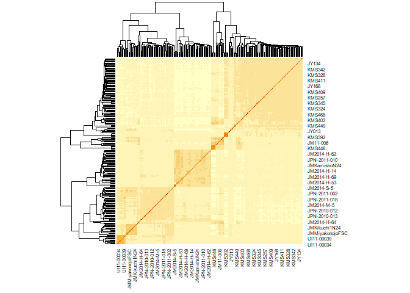
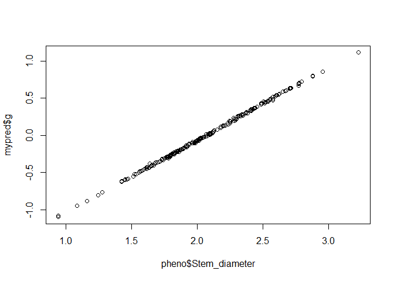
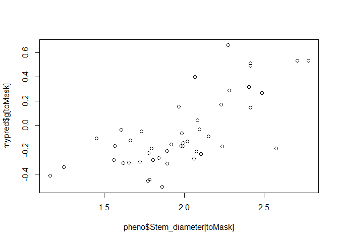
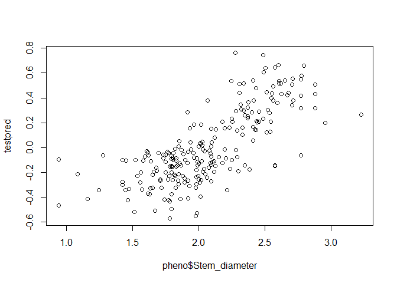
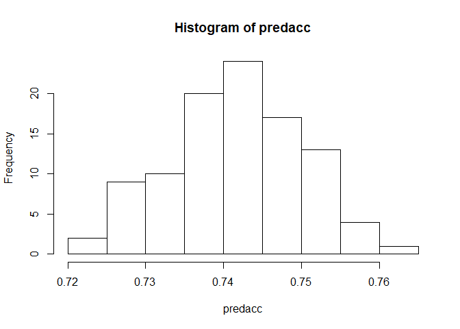

Packages and setup
------------------

We'll use RR-BLUP for kinship-based genomic prediction. Under the assumption that every locus in the genome contributes equally to variance in the phenotype, the genotype matrix can be reduced to a square kinship matrix, which considerably reduces computational time. There are other methods that assume variance is different from locus to locus, which you might look into if you are doing genomic prediction in your own work.

If you don't already have `rrBLUP`, install it:

``` r
install.packages("rrBLUP")
```

Then load it into your R environment:

``` r
library(rrBLUP)
```

So that my results are identical you yours, I am setting a random seed.

``` r
set.seed(050919)
```

Dataset
-------

We will use the *Miscanthus sacchariflorus* dataset from the [polyRAD tutorial](polyRAD_diversity_panel.html), with 268 individuals and 5097 loci. In that tutorial we formatted posterior mean genotypes for rrBLUP.

``` r
load("Msa_tetraploids_Chr05_rrb.RData")
str(rrb_geno)
```

    ##  num [1:268, 1:13168] -0.998 -0.488 -0.955 -0.95 -1 ...
    ##  - attr(*, "dimnames")=List of 2
    ##   ..$ : chr [1:268] "PMS-458" "KMS-widespread" "UI10-00117" "UI11-00005" ...
    ##   ..$ : chr [1:13168] "S05_51928_TTA" "S05_51928_TCC" "S05_51928_ATC" "S05_81981_GG" ...

Because many loci had multiple alleles, we have data for 13,168 alleles, treating each allele as though it were a biallelic marker. The common allele was omitted for each locus. The data are scaled so that `-1` indicates zero copies of the allele, and `1` indicates four copies.

``` r
rrb_geno[1:20,1:4]
```

    ##                S05_51928_TTA S05_51928_TCC S05_51928_ATC S05_81981_GG
    ## PMS-458           -0.9977491    -0.9995375   -0.48643582  -0.89401482
    ## KMS-widespread    -0.4882062    -0.9999996   -0.45221813  -0.22711990
    ## UI10-00117        -0.9552068    -0.9828333   -0.94066904  -0.08923438
    ## UI11-00005        -0.9498768    -0.9999478    0.01539608  -0.20081827
    ## UI11-00027        -0.9998837    -0.9371307   -0.86813735  -0.38057506
    ## IGR-2011-005      -0.9999818    -0.9999818   -0.97271681  -0.20729142
    ## PMS-457           -0.9991914    -0.9998661   -0.49537841  -0.95534980
    ## JY186             -0.8589097    -0.9990854   -0.59061653   0.08264042
    ## JY192             -0.9352424    -0.9994995   -0.81117141  -0.21351398
    ## JY182             -0.8445864    -0.9998000   -0.58176430  -0.52157289
    ## JY009             -0.9526232    -0.9539069   -0.87427743  -0.31316810
    ## KMS408            -0.9550198    -0.9999378   -0.86064424  -0.27379817
    ## JY008             -0.8935263    -0.8574864   -0.68295009  -0.29383659
    ## JY127             -0.9483170    -0.9926090   -0.83100771  -0.32570147
    ## KMS417            -0.8483431    -0.9998000   -0.69749405  -0.48547984
    ## JY006             -0.9277114    -0.9127454   -0.82336644  -0.30865466
    ## JY129             -0.9191291    -0.9737688   -0.76240997   0.21654157
    ## JM2014-S-3        -0.8604225    -0.8186464   -0.82442143  -0.06291690
    ## JM2014-M-3        -0.8320151    -0.9455931   -0.83181124  -0.19655112
    ## JY183             -0.4502993    -0.9999074   -0.78606101  -0.25377510

For example, here we can see that "KMS-widespread" and "JY183" each likely have one copy of the TTA allele at S05\_51928. "UI11-00005" likely has two copies of the ATC allele at this same locus.

The phenotype data is in a CSV:

``` r
pheno <- read.csv("Msa_tetraploids_pheno.csv", stringsAsFactors = FALSE)
head(pheno)
```

    ##             Taxa Stem_diameter
    ## 1        PMS-458      2.127315
    ## 2 KMS-widespread      1.780867
    ## 3     UI10-00117      2.282351
    ## 4     UI11-00005      2.197177
    ## 5     UI11-00027      2.880700
    ## 6   IGR-2011-005      2.507009

We will subset to just taxa that have data, leaving 230 taxa:

``` r
pheno <- pheno[!is.na(pheno$Stem_diameter),]
str(pheno)
```

    ## 'data.frame':    230 obs. of  2 variables:
    ##  $ Taxa         : chr  "PMS-458" "KMS-widespread" "UI10-00117" "UI11-00005" ...
    ##  $ Stem_diameter: num  2.13 1.78 2.28 2.2 2.88 ...

``` r
all(pheno$Taxa %in% rownames(rrb_geno))
```

    ## [1] TRUE

``` r
rrb_geno <- rrb_geno[pheno$Taxa,]
str(rrb_geno)
```

    ##  num [1:230, 1:13168] -0.998 -0.488 -0.955 -0.95 -1 ...
    ##  - attr(*, "dimnames")=List of 2
    ##   ..$ : chr [1:230] "PMS-458" "KMS-widespread" "UI10-00117" "UI11-00005" ...
    ##   ..$ : chr [1:13168] "S05_51928_TTA" "S05_51928_TCC" "S05_51928_ATC" "S05_81981_GG" ...

Estimating the relationship matrix
----------------------------------

From these genotypes, we will use `rrBLUP` to calculate the realized additive relationship matrix. This is accomplished with the `A.mat` function. No imputation is necessary since polyRAD already used genotype priors to impute any genotypes with zero reads.

``` r
Msa_A <- A.mat(rrb_geno)
heatmap(Msa_A)
```



The clustering makes sense here. The biggest split is between Japan (lower left) and mainland Asia (upper right), and Japan is divided into north and south.

Setting up functions for cross-validation
-----------------------------------------

To test the accuracy of our genomic prediction, we will perform five-fold cross validation. To do this, we will divide our set of individuals into five groups at random. We will then perform genomic prediction five times, each time with one of the groups being the prediction set (phenotypes unknown) and the other four being the training set (phenotypes known). We will see how accurately our predicted phenotypes match the real ones. We will repeat that whole process 100 times.

Below is a function to make the random groups.

``` r
# Function to divide a set of individuals randomly into a set of gruops
# for X-fold cross-validation.
# nind is the total number of individuals.
# ngrp is the number of groups desired.
# The output is a list of vectors, with each vector giving the indices of
# individuals in a group.
GenerateGroups <- function(nind, ngrp){
  outlist <- vector("list", ngrp)     # to contain output
  scramble <- sample(nind)            # random order for individuals
  
  nPerGrp <- rep(nind %/% ngrp, ngrp) # number of individuals in each group
  nExtra <- nind %% ngrp               # number of individuals left over
  # increase size of some groups by 1 to get to total needed
  nPerGrp <- nPerGrp + rep(c(0, 1), times = c(ngrp - nExtra, nExtra))
  
  # fill in vectors
  for(i in 1:ngrp){
    if(i == 1){
      firstind <- 1
    } else {
      firstind <- sum(nPerGrp[1:(i - 1)]) + 1
    }
    lastind <- firstind + nPerGrp[i] - 1
    outlist[[i]] <- sort(scramble[firstind:lastind])
  }
  
  return(outlist)
}

# Test the function
testgrp <- GenerateGroups(102, 5)
testgrp
```

    ## [[1]]
    ##  [1]  2  4 14 16 17 21 28 29 32 37 39 45 48 56 59 65 89 92 93 97
    ## 
    ## [[2]]
    ##  [1]  5  6  9 15 18 23 33 38 47 53 54 64 66 67 69 73 84 90 95 98
    ## 
    ## [[3]]
    ##  [1]   8  11  12  26  30  40  41  44  49  50  51  57  61  62  79  81  82
    ## [18]  83  94 102
    ## 
    ## [[4]]
    ##  [1]  1  3  7 13 19 24 27 31 34 35 36 42 43 46 68 70 76 78 85 86 96
    ## 
    ## [[5]]
    ##  [1]  10  20  22  25  52  55  58  60  63  71  72  74  75  77  80  87  88
    ## [18]  91  99 100 101

``` r
sapply(testgrp, length)
```

    ## [1] 20 20 20 21 21

If were were going to do genomic prediction using the entire dataset as the training set, we would do it using `kin.blup` like this:

``` r
mypred <- kin.blup(data = pheno, geno = "Taxa", pheno = "Stem_diameter",
                   K = Msa_A)
plot(pheno$Stem_diameter, mypred$g)
```



For cross-validation however, we want to mask some genotypes with `NA`.

``` r
phenoMasked <- pheno
toMask <- sample(230, 230/5)
toMask
```

    ##  [1] 101  43 155  41 102  70 129 189  77 151 131  35  83 182 158 207 117
    ## [18]  25 213 196 194  54 127 219 135 208  81 211  86 228  13 191 123  50
    ## [35] 143 112 181 169  84 122 197  24   8 216 205   3

``` r
phenoMasked$Stem_diameter[toMask] <- NA

mypred <- kin.blup(data = phenoMasked,
                   geno = "Taxa", pheno = "Stem_diameter",
                   K = Msa_A)
plot(pheno$Stem_diameter[toMask], mypred$g[toMask])
```



This gives a much more accurate depiction of how well genomic prediction will work.

We can put that together into a function to get predicted values for all taxa.

``` r
PredictPheno <- function(pheno, K, fold = 5){
  ntaxa <- nrow(pheno) # number of taxa
  predval <- numeric(ntaxa) # to hold predicted values
  names(predval) <- pheno$Taxa
  grps <- GenerateGroups(ntaxa, fold)
  
  for(i in 1:fold){
    toMask <- grps[[i]]
    phenoMasked <- pheno
    phenoMasked[[2]][toMask] <- NA
    mypred <- kin.blup(data = phenoMasked,
                   geno = "Taxa", pheno = names(pheno)[2],
                   K = K)
    predval[toMask] <- mypred$g[toMask]
  }
  
  return(predval)
}

testpred <- PredictPheno(pheno = pheno, K = Msa_A)
plot(pheno$Stem_diameter, testpred)
```



``` r
cor(pheno$Stem_diameter, testpred)
```

    ## [1] 0.7434333

So on this first test, we have a prediction accuracy of 0.74.

Running replicates of the cross validation
------------------------------------------

The prediction accuracy could change a lot depending on how individuals are divided into groups. For this reason, we want to repeat the above protocol at least 100 times and see what the average accuracy is.

``` r
nreps <- 100
# to hold predicted GEBVs
predmat <- matrix(nrow = nrow(pheno), ncol = nreps,
                  dimnames = list(pheno$Taxa, NULL))
# to hold prediction accuracy
predacc <- numeric(nreps)

for(i in 1:nreps){
  predmat[,i] <- PredictPheno(pheno = pheno, K = Msa_A)
  predacc[i] <- cor(pheno$Stem_diameter, predmat[,i])
}

mean(predacc)
```

    ## [1] 0.7418571

``` r
hist(predacc)
```



So, 0.74 is the mean prediction accuracy, and it doesn't tend to very a lot from there.

How can we have an accuracy so high when we only used one chromosome? Most of it can be attributed to the trait being correlated with population structure and relatedness.

If we wanted to export the GEBVs for the purpose of selecting parents for breeding, we could do it like so:

``` r
gebvs <- rowMeans(predmat)
gebvs[1:15]
```

    ##        PMS-458 KMS-widespread     UI10-00117     UI11-00005     UI11-00027 
    ##   -0.117238229   -0.162218797    0.267862042    0.187367758    0.510918504 
    ##   IGR-2011-005          JY186          JY192          JY182          JY009 
    ##    0.599161071   -0.080444245   -0.190773744   -0.050266290    0.194734550 
    ##         KMS408          JY008          JY127         KMS417          JY006 
    ##   -0.110826811    0.259864597   -0.007564962   -0.040222353    0.385877800

``` r
write.csv(gebvs, file = "Msa_gebvs.csv")
```
