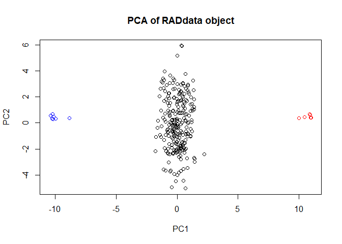
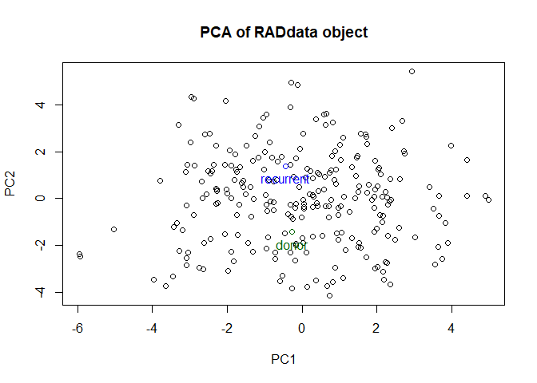
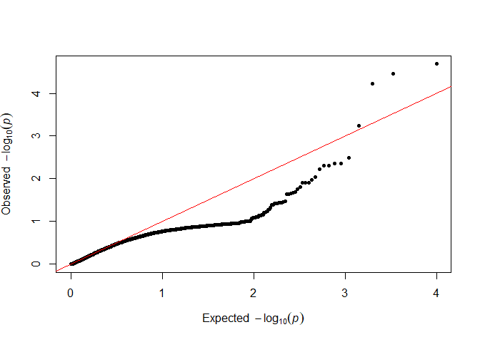
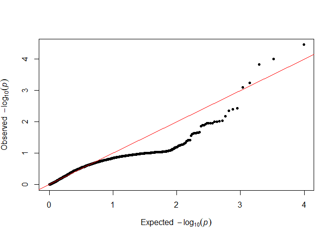
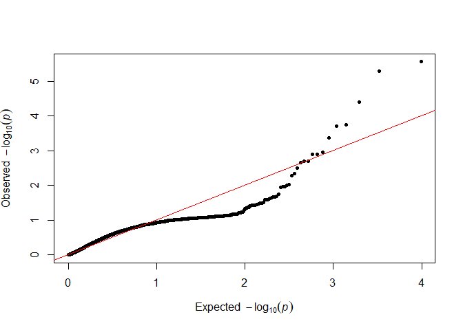
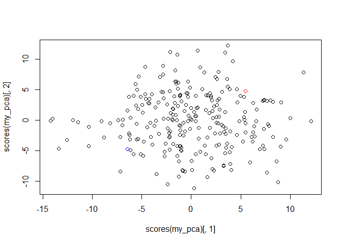
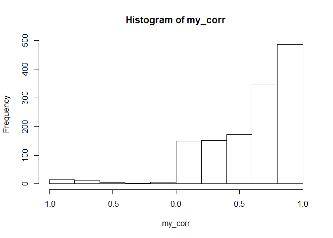

Packages for this tutorial
--------------------------

If you don't have `VariantAnnotation`, `polyRAD`, `qqman`, and `pcaMethods` installed on your computer already, get them by running the following code:

``` r
install.packages("BiocManager")
BiocManager::install("VariantAnnotation")
BiocManager::install("pcaMethods")
install.packages("polyRAD")
install.packages("qqman")
```

Now load them into your workspace by running:

``` r
library(VariantAnnotation)
library(polyRAD)
library(qqman)
library(pcaMethods)
```

Compressing and inspecting a VCF
--------------------------------

PolyRAD takes advantage of the tools available for working with VCF files from the Bioconductor package [VariantAnnotation](http://bioconductor.org/packages/release/bioc/html/VariantAnnotation.html). It is easiest to use those tools if the VCF is compressed using `bgzip` and indexed. This only needs to be done once, and then the files are saved on your computer.

``` r
my_vcf_file <- "three_chs_swetpotato.vcf"
```

``` r
my_vcf_bg <- bgzip(my_vcf_file)
indexTabix(my_vcf_bg, format = "vcf")
```

We can read the file header to get an idea of what data are in the file.

``` r
my_header <- scanVcfHeader(my_vcf_bg)
my_header
```

    ## class: VCFHeader
    ## samples(263): P1_1 P1_2 ... Ind_249 Ind_250
    ## meta(1): fileformat
    ## fixed(0):
    ## info(3): NS DP AF
    ## geno(5): GT AD DP GQ PL

``` r
samples(my_header)[1:50]
```

    ##  [1] "P1_1"   "P1_2"   "P1_3"   "P1_4"   "P1_5"   "P1_6"   "P1_7"  
    ##  [8] "P2_1"   "P2_2"   "P2_3"   "P2_4"   "P2_5"   "P2_6"   "Ind_1"
    ## [15] "Ind_2"  "Ind_3"  "Ind_4"  "Ind_5"  "Ind_6"  "Ind_7"  "Ind_8"
    ## [22] "Ind_9"  "Ind_10" "Ind_11" "Ind_12" "Ind_13" "Ind_14" "Ind_15"
    ## [29] "Ind_16" "Ind_17" "Ind_18" "Ind_19" "Ind_20" "Ind_21" "Ind_22"
    ## [36] "Ind_23" "Ind_24" "Ind_25" "Ind_26" "Ind_27" "Ind_28" "Ind_29"
    ## [43] "Ind_30" "Ind_31" "Ind_32" "Ind_33" "Ind_34" "Ind_35" "Ind_36"
    ## [50] "Ind_37"

``` r
info(my_header)
```

    ## DataFrame with 3 rows and 3 columns
    ##         Number        Type                 Description
    ##    <character> <character>                 <character>
    ## NS           1     Integer Number of Samples With Data
    ## DP           1     Integer                 Total Depth
    ## AF           .       Float            Allele Frequency

``` r
geno(my_header)
```

    ## DataFrame with 5 rows and 3 columns
    ##         Number        Type
    ##    <character> <character>
    ## GT           1      String
    ## AD           .     Integer
    ## DP           1     Integer
    ## GQ           1       Float
    ## PL           3       Float
    ##                                                                                                                   Description
    ##                                                                                                                   <character>
    ## GT                                                                                                                   Genotype
    ## AD                                                 Allelic depths for the reference and alternate alleles in the order listed
    ## DP                                                                          Read Depth (only filtered reads used for calling)
    ## GQ                                                                                                           Genotype Quality
    ## PL Normalized, Phred-scaled likelihoods for AA,AB,BB genotypes where A=ref and B=alt; not applicable if site is not biallelic

Importing the VCF into polyRAD
------------------------------

Now we'll read the VCF into polyRAD. We'll change a few parameters from their defaults. `min.ind.with.reads` and `min.ind.with.minor.allele` are used for filtering and should take the population size and design into account. We have 263 samples, so if we want a maximum of 10% missing data (fairly stringent for GBS datasets) we will set `min.ind.with.reads = 237`. Since this is an F1 population, any real allele should be found in ~50% of individuals. Let's relax that to 30% and set `min.ind.with.minor.allele = 71`. We will also set `possiblePloidies = list(6)` since we want to treat everything as autohexaploid. Since this is a small example dataset and we know there are only 6000 SNPs, we can also save computer memory by reducing `expectedAlleles` and `expectedLoci`.

``` r
my_RAD <- VCF2RADdata(my_vcf_bg, min.ind.with.reads = 237,
                      min.ind.with.minor.allele = 71,
                      possiblePloidies = list(6),
                      expectedAlleles = 12000, expectedLoci = 6000)
```

    ## Reading file...

    ## Unpacking data from VCF...

    ## Filtering markers...

    ## Phasing 1684 SNPs on chromosome 12

    ## Phasing 838 SNPs on chromosome 15

    ## Phasing 1654 SNPs on chromosome 9

    ## Reading file...

    ## Unpacking data from VCF...

    ## Filtering markers...

    ## Phasing 837 SNPs on chromosome 15

    ## Reading file...

    ## 4165 loci imported.

    ## Building RADdata object...

    ## Merging rare haplotypes...

    ## 4107 markers retained out of 4165 originally.

``` r
my_RAD
```

    ## ## RADdata object ##
    ## 263 taxa and 4107 loci
    ## 161558659 total reads
    ## Assumed sample cross-contamination rate of 0.001
    ##
    ## Possible ploidies:
    ## Autohexaploid (6)

About 1000 SNPs did not pass the filtering criteria, then another ~850 were close enough to each other to be merged into haplotypes. Lastly, ~60 were dropped because no individual allele was common enough to pass the filtering threshold.

Inspecting the `RADdata` object
-------------------------------

We can take a look at the alignment information for our markers.

``` r
my_RAD$locTable[1:20,]
```

    ##             Chr    Pos
    ## Swp_12_0001  12   3924
    ## Swp_12_0004  12  30530
    ## Swp_12_0005  12  91124
    ## Swp_12_0006  12  94713
    ## Swp_12_0007  12 133529
    ## Swp_12_0008  12 145679
    ## Swp_12_0009  12 146201
    ## Swp_12_0010  12 192541
    ## Swp_12_0011  12 201994
    ## Swp_12_0012  12 203147
    ## Swp_12_0013  12 220259
    ## Swp_12_0014  12 240553
    ## Swp_12_0015  12 242030
    ## Swp_12_0016  12 243515
    ## Swp_12_0017  12 247758
    ## Swp_12_0018  12 256965
    ## Swp_12_0020  12 256998
    ## Swp_12_0021  12 258052
    ## Swp_12_0022  12 260765
    ## Swp_12_0023  12 270995

We can also inspect allele names, and see some markers where SNPs were grouped into haplotypes.

``` r
GetAlleleNames(my_RAD)[1:50]
```

    ##  [1] "Swp_12_0001_TTA" "Swp_12_0001_ACG" "Swp_12_0004_A"  
    ##  [4] "Swp_12_0004_T"   "Swp_12_0005_T"   "Swp_12_0005_A"  
    ##  [7] "Swp_12_0006_T"   "Swp_12_0006_-"   "Swp_12_0007_A"  
    ## [10] "Swp_12_0007_T"   "Swp_12_0008_T"   "Swp_12_0008_A"  
    ## [13] "Swp_12_0009_A"   "Swp_12_0009_T"   "Swp_12_0010_A"  
    ## [16] "Swp_12_0010_-"   "Swp_12_0011_A"   "Swp_12_0011_-"  
    ## [19] "Swp_12_0012_A"   "Swp_12_0012_T"   "Swp_12_0013_T"  
    ## [22] "Swp_12_0013_C"   "Swp_12_0014_A"   "Swp_12_0014_G"  
    ## [25] "Swp_12_0015_T"   "Swp_12_0015_-"   "Swp_12_0016_G"  
    ## [28] "Swp_12_0016_A"   "Swp_12_0017_A"   "Swp_12_0017_T"  
    ## [31] "Swp_12_0018_AG"  "Swp_12_0018_AA"  "Swp_12_0018_-G"
    ## [34] "Swp_12_0020_G"   "Swp_12_0020_-"   "Swp_12_0021_T"  
    ## [37] "Swp_12_0021_A"   "Swp_12_0022_G"   "Swp_12_0022_T"  
    ## [40] "Swp_12_0023_A"   "Swp_12_0023_T"   "Swp_12_0024_C"  
    ## [43] "Swp_12_0024_-"   "Swp_12_0025_C"   "Swp_12_0025_G"  
    ## [46] "Swp_12_0026_A"   "Swp_12_0026_G"   "Swp_12_0028_CA"
    ## [49] "Swp_12_0028_CG"  "Swp_12_0028_-A"

Now we see why markers Swp\_12\_0002 and 3 are missing; they were merged into Swp\_12\_0001.

Let's get a quick PCA plot based on allelic read depth, before we do any genotype calling. This will let us confirm that the duplicate parents are really duplicates, and that all the progeny appear to be F1s. First we'll make a vector of colors to label parents and progeny.

``` r
my_col <- rep("black", nTaxa(my_RAD))
names(my_col) <- GetTaxa(my_RAD)
my_col[grep("^P1", GetTaxa(my_RAD))] <- "blue"
my_col[grep("^P2", GetTaxa(my_RAD))] <- "red"
my_col[1:30]
```

    ##    P1_1    P1_2    P1_3    P1_4    P1_5    P1_6    P1_7    P2_1    P2_2
    ##  "blue"  "blue"  "blue"  "blue"  "blue"  "blue"  "blue"   "red"   "red"
    ##    P2_3    P2_4    P2_5    P2_6   Ind_1   Ind_2   Ind_3   Ind_4   Ind_5
    ##   "red"   "red"   "red"   "red" "black" "black" "black" "black" "black"
    ##   Ind_6   Ind_7   Ind_8   Ind_9  Ind_10  Ind_11  Ind_12  Ind_13  Ind_14
    ## "black" "black" "black" "black" "black" "black" "black" "black" "black"
    ##  Ind_15  Ind_16  Ind_17
    ## "black" "black" "black"

Then we can make the plot.

``` r
plot(my_RAD, col = my_col)
```

    ## Performing principal components analysis...



This looks perfect. We don't need to remove any samples. (If we did, the `SubsetByTaxon` function would be helpful.) We can also merge read depth across parental duplicates.

``` r
my_RAD <- MergeTaxaDepth(my_RAD, paste("P1", 1:7, sep = "_"))
```

    ## 7 taxa will be merged into the taxon P1_1.

``` r
my_RAD <- MergeTaxaDepth(my_RAD, paste("P2", 1:6, sep = "_"))
```

    ## 6 taxa will be merged into the taxon P2_1.

``` r
GetTaxa(my_RAD)[1:20]
```

    ##  [1] "P1_1"   "P2_1"   "Ind_1"  "Ind_2"  "Ind_3"  "Ind_4"  "Ind_5"
    ##  [8] "Ind_6"  "Ind_7"  "Ind_8"  "Ind_9"  "Ind_10" "Ind_11" "Ind_12"
    ## [15] "Ind_13" "Ind_14" "Ind_15" "Ind_16" "Ind_17" "Ind_18"

For genotype calling, we will need to indicate which samples are the parents. Since there was no backcrossing, it does not matter which is listed as "donor" and which as "recurrent".

``` r
my_RAD <- SetDonorParent(my_RAD, "P1_1")
my_RAD <- SetRecurrentParent(my_RAD, "P2_1")
```

We can do another quick PCA to see how it looks now. Since there is only one sample of each parent, the first axis no longer distinguishes parents and progeny.

``` r
plot(my_RAD)
```

    ## Performing principal components analysis...



Testing overdispersion
----------------------

Because sequencing data are noisy, read depth ratios might deviate from the underlying allele dosage ratios more than we would expect. We can perform preliminary genotype calling, then test for this overdispersion. (I'm using `sample` to reduce the amount of time it takes to generate the plot, by only using a random subset of p-values.)

``` r
my_RAD_pre <- PipelineMapping2Parents(my_RAD, freqAllowedDeviation = 0.035,
                                      useLinkage = FALSE)
```

    ## Making initial parameter estimates...

    ## Done.

``` r
testOD <- TestOverdispersion(my_RAD_pre)
qq(sample(testOD[["10"]], 5000))
```



``` r
qq(sample(testOD[["12"]], 5000))
```



``` r
qq(sample(testOD[["14"]], 5000))
```



We want as many points as possible to follow the red line in the lower left, so we will go forward with 12 as our value.

Genotype calling
----------------

We will perform genotype calling using expected genotype frequencies in an F1 population as priors. This time, we will adjust our overdispersion parameter, and also add linkage to the model.

``` r
my_RAD <- PipelineMapping2Parents(my_RAD, freqAllowedDeviation = 0.035,
                                  useLinkage = TRUE, overdispersion = 12)
```

    ## Making initial parameter estimates...

    ## Updating priors using linkage...

    ## Done.

If polyRAD was not able to determine the inheritance pattern, the posterior probabilities will be filled with `NA`s. Additionally, if both parents were scored as homozygous, the progeny will be non-variable and the marker will not be particularly useful. We can identify and remove such markers.

``` r
my_RAD_sub <- RemoveUngenotypedLoci(my_RAD,
                                    removeNonvariant = TRUE)
my_RAD_sub
```

    ## ## RADdata object ##
    ## 252 taxa and 2347 loci
    ## 99739604 total reads
    ## Assumed sample cross-contamination rate of 0.001
    ##
    ## Possible ploidies:
    ## Autohexaploid (6)
    ##
    ## Allele frequencies estimated for mapping

Here we retain 2347 loci. We will use that subset for further analysis.

Genotype export
---------------

We can produce a matrix of the most probable genotypes.

``` r
out_geno <- GetProbableGenotypes(my_RAD_sub, naIfZeroReads = TRUE)$genotypes
out_geno[1:20,1:7]
```

    ##        Swp_12_0001_ACG Swp_12_0004_T Swp_12_0005_A Swp_12_0007_T
    ## P1_1                 3             0             0             1
    ## P2_1                 1             1             1             1
    ## Ind_1                2             1             1             1
    ## Ind_2                2             1             1             1
    ## Ind_3                3             1             1             1
    ## Ind_4                1             1             1             1
    ## Ind_5                2             1             1             1
    ## Ind_6                2             1             1             1
    ## Ind_7                3             1             1             1
    ## Ind_8                3             1             1             1
    ## Ind_9                2             1             1             1
    ## Ind_10               2             1             1             1
    ## Ind_11               2             1             1             1
    ## Ind_12               2             1             1             1
    ## Ind_13               2             1             1             1
    ## Ind_14               2             1             1             1
    ## Ind_15               3             1             1             1
    ## Ind_16               1             1             1             1
    ## Ind_17               2             1             1             1
    ## Ind_18               2             1             1             1
    ##        Swp_12_0008_A Swp_12_0009_T Swp_12_0011_-
    ## P1_1               0             0             0
    ## P2_1               1             1             1
    ## Ind_1              1             1             1
    ## Ind_2              1             1             1
    ## Ind_3              1             1             1
    ## Ind_4              1             1             1
    ## Ind_5              1             1             1
    ## Ind_6              1             0             1
    ## Ind_7              1             0             1
    ## Ind_8              1             1             1
    ## Ind_9              1             1             1
    ## Ind_10             1             0             1
    ## Ind_11             1             1             1
    ## Ind_12             1             0             1
    ## Ind_13             1             0             1
    ## Ind_14             1             0             1
    ## Ind_15             1             1             1
    ## Ind_16             1             1             1
    ## Ind_17             1             1             1
    ## Ind_18             1             1             1

A PCA can confirm that the relatedness among individuals still looks right.

``` r
my_pca <- pca(out_geno, method = "ppca")
plot(scores(my_pca)[,1], scores(my_pca)[,2],
     col = c("blue", "red", rep("black", nrow(out_geno) - 2)))
```



Now that genotypes have been called, we see progeny as being mostly between the two parents on the first axis.

We can also see the posterior mean genotypes

``` r
out_postmean <- GetWeightedMeanGenotypes(my_RAD_sub, minval = 0, maxval = 6)
out_postmean[1:20, 1:7]
```

    ##        Swp_12_0001_ACG Swp_12_0004_T Swp_12_0005_A Swp_12_0007_T
    ## P1_1         3.2046918     1.0254678     1.1151566      1.039102
    ## P2_1         1.3644259     1.0706542     1.2166453      1.043754
    ## Ind_1        2.1474927     0.9998886     0.9999984      1.000004
    ## Ind_2        2.0758444     0.9999844     0.9999997      1.000368
    ## Ind_3        2.4959398     0.9998597     0.9999980      1.000002
    ## Ind_4        1.5564783     0.9997394     0.9999931      1.000002
    ## Ind_5        2.2979795     0.9999889     0.9999998      1.002052
    ## Ind_6        2.0396853     0.9997983     0.9999993      1.000001
    ## Ind_7        2.5439993     0.9998733     0.9999972      1.000004
    ## Ind_8        2.5786597     0.9995354     0.9999977      1.000002
    ## Ind_9        1.9908908     0.9999536     0.9999991      1.000004
    ## Ind_10       2.1113531     0.9991366     0.9999933      1.000000
    ## Ind_11       1.7515587     0.9997548     0.9999975      1.000001
    ## Ind_12       1.6892979     0.9999581     0.9999994      1.000018
    ## Ind_13       2.2979795     0.9993534     0.9999952      1.000000
    ## Ind_14       1.9979533     0.9994706     0.9999975      1.000001
    ## Ind_15       2.6422610     0.9999832     0.9999992      1.000198
    ## Ind_16       0.6923537     0.9998979     0.9999991      1.000024
    ## Ind_17       1.8786148     0.9999149     0.9999996      1.000003
    ## Ind_18       1.9593875     0.9998810     0.9999995      1.000007
    ##        Swp_12_0008_A Swp_12_0009_T Swp_12_0011_-
    ## P1_1        1.091852    1.05608013     1.0786582
    ## P2_1        1.184044    1.17331927     1.2021079
    ## Ind_1       1.000000    0.99861175     1.0000000
    ## Ind_2       1.000000    0.99963611     1.0000000
    ## Ind_3       1.000000    0.98472802     1.0000000
    ## Ind_4       1.000000    0.99840325     0.9999999
    ## Ind_5       1.000000    0.99827699     1.0000000
    ## Ind_6       1.000000    0.07645925     1.0000000
    ## Ind_7       1.000000    0.06019943     1.0000000
    ## Ind_8       1.000000    0.99493510     1.0000000
    ## Ind_9       1.000000    0.99923369     0.9999999
    ## Ind_10      1.000000    0.19253141     0.9999999
    ## Ind_11      1.000000    0.99822221     1.0000000
    ## Ind_12      1.000000    0.20776835     1.0000000
    ## Ind_13      1.000000    0.31445458     0.9999991
    ## Ind_14      1.000000    0.17879608     0.9999999
    ## Ind_15      1.000000    0.99412682     1.0000000
    ## Ind_16      1.000000    0.99942423     1.0000000
    ## Ind_17      1.000000    0.99968061     1.0000000
    ## Ind_18      1.000000    0.99876567     1.0000000

Some of these don't match the expected segregation ratio, and upon inspection of read depths, we see that the depth ratios don't meet expectations for a hexaploid.

``` r
my_RAD_sub$alleleDepth[1:20,9:14]
```

    ##        Swp_12_0008_T Swp_12_0008_A Swp_12_0009_A Swp_12_0009_T
    ## P1_1            1179           105            38             1
    ## P2_1            1006           131           130            15
    ## Ind_1            277            39             7             1
    ## Ind_2             92            23             5             2
    ## Ind_3            226            18            48             1
    ## Ind_4            180            17            22             2
    ## Ind_5            226            34             9             1
    ## Ind_6            210            14            26             0
    ## Ind_7            170            12            31             0
    ## Ind_8            252            12            23             1
    ## Ind_9            227            14            12             2
    ## Ind_10           149            21            11             0
    ## Ind_11           160            12            38             3
    ## Ind_12           116            15            10             0
    ## Ind_13           234            15             5             0
    ## Ind_14           206            10            12             0
    ## Ind_15           213            22            52             2
    ## Ind_16           161            16             9             2
    ## Ind_17           197            13            16             4
    ## Ind_18           127            15             6             1
    ##        Swp_12_0011_A Swp_12_0011_-
    ## P1_1            1684           139
    ## P2_1            1177           162
    ## Ind_1            392            31
    ## Ind_2            262            42
    ## Ind_3            278            33
    ## Ind_4            295            12
    ## Ind_5            194            27
    ## Ind_6            327            17
    ## Ind_7            572            41
    ## Ind_8            426            24
    ## Ind_9            173             7
    ## Ind_10           437            20
    ## Ind_11           279            18
    ## Ind_12           363            36
    ## Ind_13           324             6
    ## Ind_14           173             7
    ## Ind_15           311            22
    ## Ind_16           265            34
    ## Ind_17           224            19
    ## Ind_18           392            34

We can save the RADdata object, and also export to MAPpoly.

``` r
save(my_RAD_sub, file = "sweetpotato_F1_RADdata.RData")
Export_MAPpoly(my_RAD_sub, file = "sweetpotato_F1_polyRAD_MAPpoly.txt")
```

Comparison to SuperMASSA results
--------------------------------

``` r
load("supermassa_result.rda")
dat.swp$geno.dose[1:10,1:10]
```

    ##             Ind_1 Ind_10 Ind_100 Ind_101 Ind_102 Ind_103 Ind_104 Ind_105
    ## Swp_12_0005     7      7       7       7       7       7       7       7
    ## Swp_12_0006     7      3       2       7       2       7       7       7
    ## Swp_12_0008     7      7       7       7       7       7       7       7
    ## Swp_12_0009     7      0       0       7       1       7       0       7
    ## Swp_12_0010     7      3       7       7       2       7       7       4
    ## Swp_12_0011     7      7       7       7       7       7       7       7
    ## Swp_12_0013     7      7       7       7       7       7       7       7
    ## Swp_12_0014     7      7       7       7       7       7       7       7
    ## Swp_12_0015     0      7       0       0       0       0       0       7
    ## Swp_12_0017     7      7       7       7       7       7       7       7
    ##             Ind_106 Ind_107
    ## Swp_12_0005       7       7
    ## Swp_12_0006       7       7
    ## Swp_12_0008       7       7
    ## Swp_12_0009       0       0
    ## Swp_12_0010       7       3
    ## Swp_12_0011       7       7
    ## Swp_12_0013       7       7
    ## Swp_12_0014       7       7
    ## Swp_12_0015       0       0
    ## Swp_12_0017       7       7

We'll calculate the posterior mean genotypes from the SuperMASSA results to compare to those from polyRAD.

``` r
prob_supermassa <- as.matrix(dat.swp$geno[,-(1:2)])
wm_vect <- rowSums(sweep(prob_supermassa, 2, 0:6, "*"))
postmean_supermassa <- matrix(0, nrow = dat.swp$n.ind, ncol = dat.swp$n.mrk,
                            dimnames = list(dat.swp$ind.names, dat.swp$mrk.names))
for(i in 1:nrow(dat.swp$geno)){
  ind <- dat.swp$geno$ind[i]
  mrk <- dat.swp$geno$mrk[i]
  postmean_supermassa[ind, mrk] <- wm_vect[i]
}
```

We'll get correlations between posterior mean genotypes from SuperMASSA and posterior mean genotypes from polyRAD.

``` r
common_loc <- GetLoci(my_RAD_sub)[GetLoci(my_RAD_sub) %in% dat.swp$mrk.names]
my_corr <- rep(NA_real_, length(common_loc))
names(my_corr) <- common_loc

for(mrk in common_loc){
  polyRAD_match <- grep(mrk, colnames(out_postmean))
  if(length(polyRAD_match) > 1) next
  geno1 <- postmean_supermassa[,mrk]
  geno2 <- out_postmean[dat.swp$ind.names, polyRAD_match]
  my_corr[mrk] <- cor(geno1, geno2, use = "pairwise.complete.obs")
}

hist(my_corr)
```



``` r
median(my_corr, na.rm = TRUE)
```

    ## [1] 0.7167871

Most, but not all, markers have moderately high correlation between the two methods.
