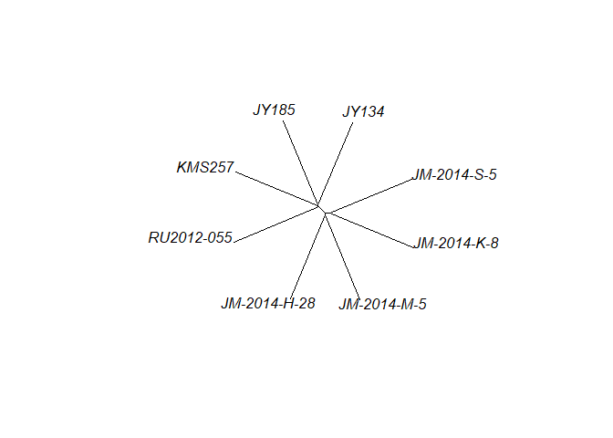
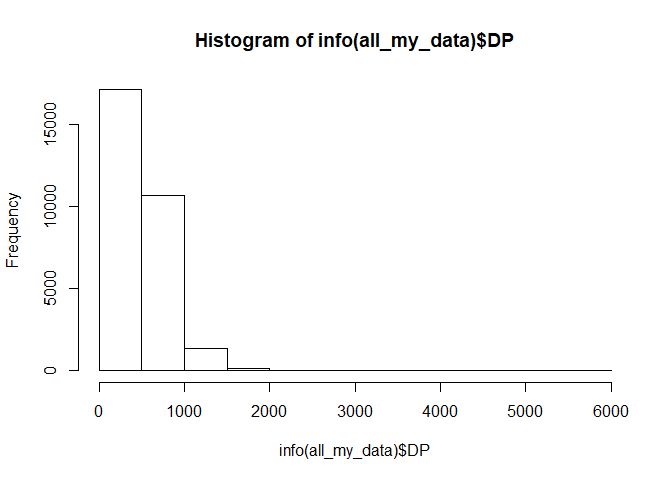
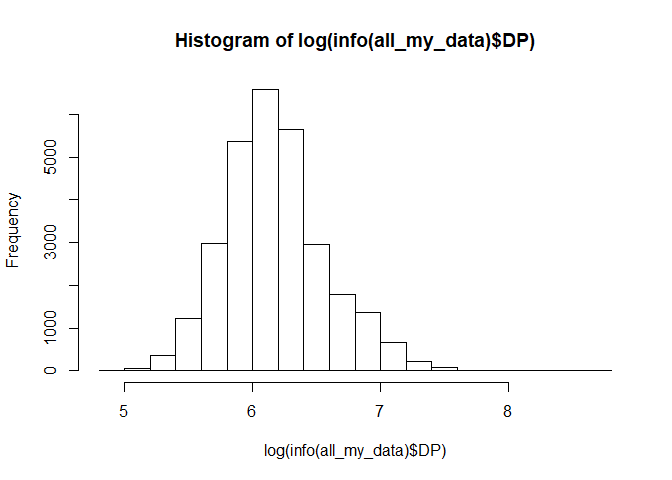

Packages for this tutorial
--------------------------

We will use the `VariantAnnotation` package from [Bioconductor](http://bioconductor.org/packages/release/bioc/html/VariantAnnotation.html) to read and filter VCFs. We will also use `ape` to do a phylogenetic tree. If you don't have these packages already, install them like so:

``` r
install.packages("BiocManager", "ape")
BiocManager::install("VariantAnnotation")
```

Then load them.

``` r
library(VariantAnnotation)
library(ape)
```

Data for this tutorial
----------------------

We will use the VCF that was generated during the GBS-SNP-CROP [tutorial](calling_without_reference.html), which we named `Msa_GSCdemo.vcf`. It contains data for about 38K markers on eight tetraploid individuals of *Miscanthus sacchariflorus*.

It is generally easier to work with VCFs in `VariantAnnotation` if they have been zipped and indexed, so we'll do that first.

``` r
mybg <- bgzip("Msa_GSCdemo.vcf")
indexTabix(mybg, format = "vcf")
```

We can take a look at some information from the file header.

``` r
hdr <- scanVcfHeader(mybg)
hdr
```

    ## class: VCFHeader 
    ## samples(8): JM-2014-H-28 JM-2014-K-8 ... KMS257 RU2012-055
    ## meta(4): fileDate fileformat phasing source
    ## fixed(0):
    ## info(5): AC AF DP AV NS
    ## geno(2): GT AD

``` r
samples(hdr)
```

    ## [1] "JM-2014-H-28" "JM-2014-K-8"  "JM-2014-M-5"  "JM-2014-S-5" 
    ## [5] "JY134"        "JY185"        "KMS257"       "RU2012-055"

``` r
meta(hdr)$source
```

    ## DataFrame with 1 row and 1 column
    ##               Value
    ##         <character>
    ## source GBS-SNP-CROP

``` r
geno(hdr)
```

    ## DataFrame with 2 rows and 3 columns
    ##         Number        Type  Description
    ##    <character> <character>  <character>
    ## GT           1      String     Genotype
    ## AD           R     Integer Allele Depth

And confirm this matches the text in the file.

``` r
cat(readLines(mybg, 20), sep = "\n")
```

    ## ##fileformat=VCFv4.2
    ## ##fileDate=Thu Apr 25 10:55:57 2019
    ## ##source=GBS-SNP-CROP
    ## ##phasing=partial
    ## ##INFO=<ID=AC,Number=A,Type=Integer,Description="Allele Count">
    ## ##INFO=<ID=AF,Number=A,Type=Integer,Description="Allele Frequency">
    ## ##INFO=<ID=DP,Number=1,Type=Integer,Description="Total Depth">
    ## ##INFO=<ID=AV,Number=1,Type=Integer,Description="Average Depth">
    ## ##INFO=<ID=NS,Number=1,Type=Integer,Description="Number of Samples With Data">
    ## ##FORMAT=<ID=GT,Number=1,Type=String,Description="Genotype">
    ## ##FORMAT=<ID=AD,Number=R,Type=Integer,Description="Allele Depth">
    ## #CHROM   POS ID  REF ALT QUAL    FILTER  INFO    FORMAT  JM-2014-H-28    JM-2014-K-8 JM-2014-M-5 JM-2014-S-5 JY134   JY185   KMS257  RU2012-055
    ## MockRefGenome    1731    .   A   G   .   PASS    AC=8;AF=0.500;DP=7403;AV=925.38;NS=8    GT:AD   0/1:189,76  0/1:511,419 0/1:238,191 0/1:845,644 0/1:607,600 0/1:233,204 0/1:726,480 0/1:779,661
    ## MockRefGenome    1851    .   T   A   .   PASS    AC=7;AF=0.438;DP=6180;AV=871.14;NS=7    GT:AD   0/1:646,167 0/1:720,102 0/1:240,48  0/1:520,103 0/1:898,188 ./.:.,. 0/1:679,170 0/1:1342,275
    ## MockRefGenome    3311    .   A   G   .   PASS    AC=3;AF=0.188;DP=4447;AV=555.88;NS=8    GT:AD   0/0:23,0    0/0:349,0   0/0:464,0   0/1:521,165 0/1:620,121 0/1:311,104 0/0:898,0   0/0:871,0
    ## MockRefGenome    3833    .   G   T   .   PASS    AC=8;AF=0.500;DP=4091;AV=511.38;NS=8    GT:AD   0/1:460,130 0/1:359,230 0/1:283,104 0/1:335,174 0/1:607,178 0/1:160,61  0/1:329,86  0/1:496,99
    ## MockRefGenome    5102    .   T   C   .   PASS    AC=8;AF=0.500;DP=4108;AV=513.50;NS=8    GT:AD   0/1:203,154 0/1:299,118 0/1:181,52  0/1:616,209 0/1:524,191 0/1:253,58  0/1:445,210 0/1:440,155
    ## MockRefGenome    5104    .   C   G   .   PASS    AC=8;AF=0.500;DP=4107;AV=513.38;NS=8    GT:AD   0/1:203,155 0/1:299,118 0/1:181,50  0/1:596,230 0/1:514,200 0/1:248,63  0/1:430,226 0/1:439,155
    ## MockRefGenome    5127    .   G   A   .   PASS    AC=8;AF=0.500;DP=4107;AV=513.38;NS=8    GT:AD   0/1:203,155 0/1:298,118 0/1:181,52  0/1:595,230 0/1:514,200 0/1:245,63  0/1:431,227 0/1:440,155
    ## MockRefGenome    5327    .   A   G   .   PASS    AC=8;AF=0.500;DP=3290;AV=411.25;NS=8    GT:AD   0/1:155,104 0/1:384,91  0/1:125,68  0/1:251,41  0/1:291,89  0/1:161,35  0/1:478,98  0/1:734,185

Making a prefilter
------------------

I know that *Miscanthus* has a whole genome duplication (even before the autotetraploidy in these *M. sacchariflorus* accessions) and so even with the paralog filtering that was performed by GBS-SNP-CROP, I'm suspicious that some paralogs made it through. Of those first few markers that I printed out, I can see that most of them are heterozygous for all individuals. Those markers are probably merged paralogs, and definitely not informative, so I would like to get rid of them.

One option from `VariantAnnotation` is to make a *prefilter*. This is a function that treats each line of the VCF genotype table as a text string, and returns `TRUE` or `FALSE` incidating whether or not that line should pass the filter. One very handy function for building prefilter functions is `grepl`, since it searches for a particular string or pattern, and returns `TRUE` if it finds it and `FALSE` otherwise. Another handy function is `gregexpr` if you want to know how many times you find a particular pattern in each line.

If all eight samples are either heterozygous or missing, I want to discard the marker. In the sense of the file format, this means that the `GT` field for every sample is either `0/1` or `./.`. Another way of looking at it is that there would be no homozygotes, *i.e.* no `0/0` and no `1/1`. Here's a function to perform that check.

``` r
NotAllHet <- function(lines){
  found00 <- grepl("0/0:", lines)
  found11 <- grepl("1/1:", lines)
  return(found00 | found11)
}
```

We can test it with the first few lines of the file, ignoring the header lines.

``` r
mylines <- readLines(mybg, 30)
# skip header lines starting with "#"
mylines <- mylines[!grepl("^#", mylines)]

keepem <- NotAllHet(mylines)
cat(mylines[keepem], sep = "\n")
```

    ## MockRefGenome    3311    .   A   G   .   PASS    AC=3;AF=0.188;DP=4447;AV=555.88;NS=8    GT:AD   0/0:23,0    0/0:349,0   0/0:464,0   0/1:521,165 0/1:620,121 0/1:311,104 0/0:898,0   0/0:871,0
    ## MockRefGenome    6284    .   G   A   .   PASS    AC=5;AF=0.312;DP=3185;AV=398.00;NS=8    GT:AD   0/0:292,1   0/0:713,0   0/1:235,60  0/1:474,172 0/1:234,219 0/1:124,128 0/1:153,44  0/0:336,0
    ## MockRefGenome    6333    .   A   T   .   PASS    AC=5;AF=0.312;DP=3169;AV=396.12;NS=8    GT:AD   0/0:291,0   0/0:711,0   0/1:223,69  0/1:437,203 0/1:234,219 0/1:125,126 0/1:118,78  0/0:335,0
    ## MockRefGenome    7285    .   C   T   .   PASS    AC=3;AF=0.188;DP=3123;AV=423.43;NS=7    GT:AD   0/0:388,0   0/0:552,0   ./.:.,. 0/1:372,98  0/1:489,334 0/1:138,123 0/0:235,1   0/0:235,0

``` r
cat(mylines[!keepem], sep = "\n")
```

    ## MockRefGenome    1731    .   A   G   .   PASS    AC=8;AF=0.500;DP=7403;AV=925.38;NS=8    GT:AD   0/1:189,76  0/1:511,419 0/1:238,191 0/1:845,644 0/1:607,600 0/1:233,204 0/1:726,480 0/1:779,661
    ## MockRefGenome    1851    .   T   A   .   PASS    AC=7;AF=0.438;DP=6180;AV=871.14;NS=7    GT:AD   0/1:646,167 0/1:720,102 0/1:240,48  0/1:520,103 0/1:898,188 ./.:.,. 0/1:679,170 0/1:1342,275
    ## MockRefGenome    3833    .   G   T   .   PASS    AC=8;AF=0.500;DP=4091;AV=511.38;NS=8    GT:AD   0/1:460,130 0/1:359,230 0/1:283,104 0/1:335,174 0/1:607,178 0/1:160,61  0/1:329,86  0/1:496,99
    ## MockRefGenome    5102    .   T   C   .   PASS    AC=8;AF=0.500;DP=4108;AV=513.50;NS=8    GT:AD   0/1:203,154 0/1:299,118 0/1:181,52  0/1:616,209 0/1:524,191 0/1:253,58  0/1:445,210 0/1:440,155
    ## MockRefGenome    5104    .   C   G   .   PASS    AC=8;AF=0.500;DP=4107;AV=513.38;NS=8    GT:AD   0/1:203,155 0/1:299,118 0/1:181,50  0/1:596,230 0/1:514,200 0/1:248,63  0/1:430,226 0/1:439,155
    ## MockRefGenome    5127    .   G   A   .   PASS    AC=8;AF=0.500;DP=4107;AV=513.38;NS=8    GT:AD   0/1:203,155 0/1:298,118 0/1:181,52  0/1:595,230 0/1:514,200 0/1:245,63  0/1:431,227 0/1:440,155
    ## MockRefGenome    5327    .   A   G   .   PASS    AC=8;AF=0.500;DP=3290;AV=411.25;NS=8    GT:AD   0/1:155,104 0/1:384,91  0/1:125,68  0/1:251,41  0/1:291,89  0/1:161,35  0/1:478,98  0/1:734,185
    ## MockRefGenome    5498    .   A   C   .   PASS    AC=7;AF=0.438;DP=3112;AV=400.14;NS=7    GT:AD   ./.:.,. 0/1:344,71  0/1:96,53   0/1:338,95  0/1:418,91  0/1:247,81  0/1:279,80  0/1:481,127
    ## MockRefGenome    6514    .   G   C   .   PASS    AC=7;AF=0.438;DP=3970;AV=566.86;NS=7    GT:AD   0/1:360,189 0/1:323,121 0/1:122,111 0/1:227,89  0/1:478,177 ./.:.,. 0/1:337,246 0/1:738,450
    ## MockRefGenome    6832    .   A   T   .   PASS    AC=7;AF=0.438;DP=10029;AV=1204.14;NS=7  GT:AD   0/1:1479,226    0/1:1216,210    0/1:641,105 ./.:.,. 0/1:651,87  0/1:325,55  0/1:1333,238    0/1:1580,283
    ## MockRefGenome    6835    .   G   T   .   PASS    AC=7;AF=0.438;DP=9750;AV=1339.14;NS=7   GT:AD   0/1:1447,240    0/1:1127,269    0/1:602,112 0/1:1290,274    0/1:531,154 ./.:.,. 0/1:1289,222    0/1:1546,271
    ## MockRefGenome    7510    .   C   A   .   PASS    AC=8;AF=0.500;DP=2853;AV=356.62;NS=8    GT:AD   0/1:203,67  0/1:262,77  0/1:131,48  0/1:222,102 0/1:515,111 0/1:225,57  0/1:407,71  0/1:253,102
    ## MockRefGenome    8478    .   C   G   .   PASS    AC=8;AF=0.500;DP=4276;AV=534.50;NS=8    GT:AD   0/1:363,115 0/1:493,131 0/1:196,84  0/1:317,104 0/1:562,122 0/1:253,44  0/1:439,128 0/1:756,169
    ## MockRefGenome    8490    .   G   C   .   PASS    AC=8;AF=0.500;DP=4272;AV=534.00;NS=8    GT:AD   0/1:251,227 0/1:368,254 0/1:154,126 0/1:256,165 0/1:398,286 0/1:206,91  0/1:346,220 0/1:614,310

Here is how I would apply that filter to my VCF file, exporting a filtered VCF.

``` r
filter1_file <- "Msa_GSCdemo_filter1.vcf"
```

``` r
filterVcf(mybg, genome = "MsaMockReference",
          destination = filter1_file,
          prefilters = FilterRules(list(NotAllHet)))
```

And I can confirm that it looks filtered.

``` r
cat(readLines(filter1_file, 20), sep = "\n")
```

    ## ##fileformat=VCFv4.2
    ## ##fileDate=Thu Apr 25 10:55:57 2019
    ## ##source=GBS-SNP-CROP
    ## ##phasing=partial
    ## ##INFO=<ID=AC,Number=A,Type=Integer,Description="Allele Count">
    ## ##INFO=<ID=AF,Number=A,Type=Integer,Description="Allele Frequency">
    ## ##INFO=<ID=DP,Number=1,Type=Integer,Description="Total Depth">
    ## ##INFO=<ID=AV,Number=1,Type=Integer,Description="Average Depth">
    ## ##INFO=<ID=NS,Number=1,Type=Integer,Description="Number of Samples With Data">
    ## ##FORMAT=<ID=GT,Number=1,Type=String,Description="Genotype">
    ## ##FORMAT=<ID=AD,Number=R,Type=Integer,Description="Allele Depth">
    ## #CHROM   POS ID  REF ALT QUAL    FILTER  INFO    FORMAT  JM-2014-H-28    JM-2014-K-8 JM-2014-M-5 JM-2014-S-5 JY134   JY185   KMS257  RU2012-055
    ## MockRefGenome    3311    .   A   G   .   PASS    AC=3;AF=0.188;DP=4447;AV=555.88;NS=8    GT:AD   0/0:23,0    0/0:349,0   0/0:464,0   0/1:521,165 0/1:620,121 0/1:311,104 0/0:898,0   0/0:871,0
    ## MockRefGenome    6284    .   G   A   .   PASS    AC=5;AF=0.312;DP=3185;AV=398.00;NS=8    GT:AD   0/0:292,1   0/0:713,0   0/1:235,60  0/1:474,172 0/1:234,219 0/1:124,128 0/1:153,44  0/0:336,0
    ## MockRefGenome    6333    .   A   T   .   PASS    AC=5;AF=0.312;DP=3169;AV=396.12;NS=8    GT:AD   0/0:291,0   0/0:711,0   0/1:223,69  0/1:437,203 0/1:234,219 0/1:125,126 0/1:118,78  0/0:335,0
    ## MockRefGenome    7285    .   C   T   .   PASS    AC=3;AF=0.188;DP=3123;AV=423.43;NS=7    GT:AD   0/0:388,0   0/0:552,0   ./.:.,. 0/1:372,98  0/1:489,334 0/1:138,123 0/0:235,1   0/0:235,0
    ## MockRefGenome    8822    .   T   A   .   PASS    AC=4;AF=0.250;DP=5573;AV=718.86;NS=7    GT:AD   0/0:264,0   ./.:.,. 0/1:300,63  0/1:670,87  0/0:963,0   0/1:199,29  0/0:872,0   0/1:1308,277
    ## MockRefGenome    11589   .   C   A   .   PASS    AC=3;AF=0.188;DP=3951;AV=493.88;NS=8    GT:AD   0/1:281,103 0/1:429,334 0/1:202,109 0/0:541,0   0/0:583,0   0/0:225,0   0/0:576,0   0/0:568,0
    ## MockRefGenome    12355   .   C   T   .   PASS    AC=2;AF=0.125;DP=1681;AV=222.00;NS=7    GT:AD   0/0:287,1   0/1:215,55  0/0:57,0    0/1:176,32  0/0:169,0   ./.:.,. 0/0:263,0   0/0:300,0
    ## MockRefGenome    12663   .   T   C   .   PASS    AC=2;AF=0.125;DP=1807;AV=226.29;NS=7    GT:AD   0/0:118,0   ./.:.,. 0/0:76,0    0/1:327,192 0/0:270,0   0/1:50,9    0/0:223,0   0/0:319,0

Then zip and index it.

``` r
filter1_bg <- bgzip(filter1_file)
indexTabix(filter1_bg, format = "vcf")
```

Importing data from a VCF
-------------------------

This is a pretty small VCF, so let's first explore what happens when we import the whole thing.

``` r
all_my_data <- readVcf(filter1_bg)
all_my_data
```

    ## class: CollapsedVCF 
    ## dim: 29294 8 
    ## rowRanges(vcf):
    ##   GRanges with 5 metadata columns: paramRangeID, REF, ALT, QUAL, FILTER
    ## info(vcf):
    ##   DataFrame with 5 columns: AC, AF, DP, AV, NS
    ## info(header(vcf)):
    ##       Number Type    Description                
    ##    AC A      Integer Allele Count               
    ##    AF A      Integer Allele Frequency           
    ##    DP 1      Integer Total Depth                
    ##    AV 1      Integer Average Depth              
    ##    NS 1      Integer Number of Samples With Data
    ## geno(vcf):
    ##   SimpleList of length 2: GT, AD
    ## geno(header(vcf)):
    ##       Number Type    Description 
    ##    GT 1      String  Genotype    
    ##    AD R      Integer Allele Depth

We kept 29K markers (pretty good given how heavily filtered the first few lines were). We also see a bunch of slots in the VCF object that we can explore.

We can get to the header, with the same data we found using `scanVcfHeader` on the file.

``` r
header(all_my_data)
```

    ## class: VCFHeader 
    ## samples(8): JM-2014-H-28 JM-2014-K-8 ... KMS257 RU2012-055
    ## meta(4): fileDate fileformat phasing source
    ## fixed(0):
    ## info(5): AC AF DP AV NS
    ## geno(2): GT AD

Here's the data from the leftmost columns of the genotype table. This is a `GRanges` object, which is a special kind of table used in Bioconductor for representing genomic coordinates.

``` r
rowRanges(all_my_data)
```

    ## GRanges object with 29294 ranges and 5 metadata columns:
    ##                                   seqnames    ranges strand | paramRangeID
    ##                                      <Rle> <IRanges>  <Rle> |     <factor>
    ##       MockRefGenome:3311_A/G MockRefGenome      3311      * |         <NA>
    ##       MockRefGenome:6284_G/A MockRefGenome      6284      * |         <NA>
    ##       MockRefGenome:6333_A/T MockRefGenome      6333      * |         <NA>
    ##       MockRefGenome:7285_C/T MockRefGenome      7285      * |         <NA>
    ##       MockRefGenome:8822_T/A MockRefGenome      8822      * |         <NA>
    ##                          ...           ...       ...    ... .          ...
    ##   MockRefGenome:39977669_A/G MockRefGenome  39977669      * |         <NA>
    ##   MockRefGenome:40101335_G/T MockRefGenome  40101335      * |         <NA>
    ##   MockRefGenome:40259299_T/C MockRefGenome  40259299      * |         <NA>
    ##   MockRefGenome:40949663_A/T MockRefGenome  40949663      * |         <NA>
    ##   MockRefGenome:40949695_A/G MockRefGenome  40949695      * |         <NA>
    ##                                         REF                ALT      QUAL
    ##                              <DNAStringSet> <DNAStringSetList> <numeric>
    ##       MockRefGenome:3311_A/G              A                  G      <NA>
    ##       MockRefGenome:6284_G/A              G                  A      <NA>
    ##       MockRefGenome:6333_A/T              A                  T      <NA>
    ##       MockRefGenome:7285_C/T              C                  T      <NA>
    ##       MockRefGenome:8822_T/A              T                  A      <NA>
    ##                          ...            ...                ...       ...
    ##   MockRefGenome:39977669_A/G              A                  G      <NA>
    ##   MockRefGenome:40101335_G/T              G                  T      <NA>
    ##   MockRefGenome:40259299_T/C              T                  C      <NA>
    ##   MockRefGenome:40949663_A/T              A                  T      <NA>
    ##   MockRefGenome:40949695_A/G              A                  G      <NA>
    ##                                   FILTER
    ##                              <character>
    ##       MockRefGenome:3311_A/G        PASS
    ##       MockRefGenome:6284_G/A        PASS
    ##       MockRefGenome:6333_A/T        PASS
    ##       MockRefGenome:7285_C/T        PASS
    ##       MockRefGenome:8822_T/A        PASS
    ##                          ...         ...
    ##   MockRefGenome:39977669_A/G        PASS
    ##   MockRefGenome:40101335_G/T        PASS
    ##   MockRefGenome:40259299_T/C        PASS
    ##   MockRefGenome:40949663_A/T        PASS
    ##   MockRefGenome:40949695_A/G        PASS
    ##   -------
    ##   seqinfo: 1 sequence from an unspecified genome; no seqlengths

The INFO column from the VCF also got unpacked into its own table.

``` r
info(all_my_data)
```

    ## DataFrame with 29294 rows and 5 columns
    ##                                       AC            AF        DP        AV
    ##                            <IntegerList> <IntegerList> <integer> <integer>
    ## MockRefGenome:3311_A/G                 3             0      4447       555
    ## MockRefGenome:6284_G/A                 5             0      3185       398
    ## MockRefGenome:6333_A/T                 5             0      3169       396
    ## MockRefGenome:7285_C/T                 3             0      3123       423
    ## MockRefGenome:8822_T/A                 4             0      5573       718
    ## ...                                  ...           ...       ...       ...
    ## MockRefGenome:39977669_A/G             2             0       235        29
    ## MockRefGenome:40101335_G/T             2             0       198        27
    ## MockRefGenome:40259299_T/C             6             0       303        41
    ## MockRefGenome:40949663_A/T            10             0       353        44
    ## MockRefGenome:40949695_A/G             8             0       251        31
    ##                                   NS
    ##                            <integer>
    ## MockRefGenome:3311_A/G             8
    ## MockRefGenome:6284_G/A             8
    ## MockRefGenome:6333_A/T             8
    ## MockRefGenome:7285_C/T             7
    ## MockRefGenome:8822_T/A             7
    ## ...                              ...
    ## MockRefGenome:39977669_A/G         8
    ## MockRefGenome:40101335_G/T         7
    ## MockRefGenome:40259299_T/C         7
    ## MockRefGenome:40949663_A/T         8
    ## MockRefGenome:40949695_A/G         8

We can get the definitions of those columns from the header.

``` r
info(header(all_my_data))
```

    ## DataFrame with 5 rows and 3 columns
    ##         Number        Type                 Description
    ##    <character> <character>                 <character>
    ## AC           A     Integer                Allele Count
    ## AF           A     Integer            Allele Frequency
    ## DP           1     Integer                 Total Depth
    ## AV           1     Integer               Average Depth
    ## NS           1     Integer Number of Samples With Data

Last but certainly not least, there are the data from the genotypes table. This includes strings representing the genotypes (`GT`) and allelic read depths (`AD`).

``` r
geno(all_my_data)$GT[1:10,]
```

    ##                         JM-2014-H-28 JM-2014-K-8 JM-2014-M-5 JM-2014-S-5
    ## MockRefGenome:3311_A/G  "0/0"        "0/0"       "0/0"       "0/1"      
    ## MockRefGenome:6284_G/A  "0/0"        "0/0"       "0/1"       "0/1"      
    ## MockRefGenome:6333_A/T  "0/0"        "0/0"       "0/1"       "0/1"      
    ## MockRefGenome:7285_C/T  "0/0"        "0/0"       "./."       "0/1"      
    ## MockRefGenome:8822_T/A  "0/0"        "./."       "0/1"       "0/1"      
    ## MockRefGenome:11589_C/A "0/1"        "0/1"       "0/1"       "0/0"      
    ## MockRefGenome:12355_C/T "0/0"        "0/1"       "0/0"       "0/1"      
    ## MockRefGenome:12663_T/C "0/0"        "./."       "0/0"       "0/1"      
    ## MockRefGenome:13346_C/A "0/0"        "0/1"       "0/0"       "0/1"      
    ## MockRefGenome:13563_C/T "0/0"        "0/0"       "0/0"       "0/0"      
    ##                         JY134 JY185 KMS257 RU2012-055
    ## MockRefGenome:3311_A/G  "0/1" "0/1" "0/0"  "0/0"     
    ## MockRefGenome:6284_G/A  "0/1" "0/1" "0/1"  "0/0"     
    ## MockRefGenome:6333_A/T  "0/1" "0/1" "0/1"  "0/0"     
    ## MockRefGenome:7285_C/T  "0/1" "0/1" "0/0"  "0/0"     
    ## MockRefGenome:8822_T/A  "0/0" "0/1" "0/0"  "0/1"     
    ## MockRefGenome:11589_C/A "0/0" "0/0" "0/0"  "0/0"     
    ## MockRefGenome:12355_C/T "0/0" "./." "0/0"  "0/0"     
    ## MockRefGenome:12663_T/C "0/0" "0/1" "0/0"  "0/0"     
    ## MockRefGenome:13346_C/A "./." "0/0" "0/1"  "0/0"     
    ## MockRefGenome:13563_C/T "./." "0/0" "0/1"  "0/1"

``` r
geno(all_my_data)$AD[1:10,]
```

    ##                         JM-2014-H-28 JM-2014-K-8 JM-2014-M-5 JM-2014-S-5
    ## MockRefGenome:3311_A/G  Integer,2    Integer,2   Integer,2   Integer,2  
    ## MockRefGenome:6284_G/A  Integer,2    Integer,2   Integer,2   Integer,2  
    ## MockRefGenome:6333_A/T  Integer,2    Integer,2   Integer,2   Integer,2  
    ## MockRefGenome:7285_C/T  Integer,2    Integer,2   Integer,2   Integer,2  
    ## MockRefGenome:8822_T/A  Integer,2    Integer,2   Integer,2   Integer,2  
    ## MockRefGenome:11589_C/A Integer,2    Integer,2   Integer,2   Integer,2  
    ## MockRefGenome:12355_C/T Integer,2    Integer,2   Integer,2   Integer,2  
    ## MockRefGenome:12663_T/C Integer,2    Integer,2   Integer,2   Integer,2  
    ## MockRefGenome:13346_C/A Integer,2    Integer,2   Integer,2   Integer,2  
    ## MockRefGenome:13563_C/T Integer,2    Integer,2   Integer,2   Integer,2  
    ##                         JY134     JY185     KMS257    RU2012-055
    ## MockRefGenome:3311_A/G  Integer,2 Integer,2 Integer,2 Integer,2 
    ## MockRefGenome:6284_G/A  Integer,2 Integer,2 Integer,2 Integer,2 
    ## MockRefGenome:6333_A/T  Integer,2 Integer,2 Integer,2 Integer,2 
    ## MockRefGenome:7285_C/T  Integer,2 Integer,2 Integer,2 Integer,2 
    ## MockRefGenome:8822_T/A  Integer,2 Integer,2 Integer,2 Integer,2 
    ## MockRefGenome:11589_C/A Integer,2 Integer,2 Integer,2 Integer,2 
    ## MockRefGenome:12355_C/T Integer,2 Integer,2 Integer,2 Integer,2 
    ## MockRefGenome:12663_T/C Integer,2 Integer,2 Integer,2 Integer,2 
    ## MockRefGenome:13346_C/A Integer,2 Integer,2 Integer,2 Integer,2 
    ## MockRefGenome:13563_C/T Integer,2 Integer,2 Integer,2 Integer,2

``` r
geno(all_my_data)$AD[[1,1]]
```

    ## [1] 23  0

This is about the stage where I'd like to do a sanity check to confirm that my samples show the pattern of relatedness that I'm expecting. I will convert the diploidized genotypes to numbers and make a neighbor-joining tree.

``` r
numgen <- matrix(NA_integer_, nrow = dim(all_my_data)[1],
                 ncol = dim(all_my_data)[2],
                 dimnames = dimnames(geno(all_my_data)$GT))
numgen[geno(all_my_data)$GT == "0/0"] <- 0L
numgen[geno(all_my_data)$GT == "0/1"] <- 1L
numgen[geno(all_my_data)$GT == "1/1"] <- 2L

mydist <- dist(t(numgen))
mynj <- nj(mydist)
plot(mynj, type = "unrooted")
```



We can see a clustering of Japan vs. the mainland, and northern vs. southern Japan, as expected.

Making a filter
---------------

Before, we did prefiltering based on text processing alone. However, we can also make functions to filter the data after it has been imported to R.

We had some rough cutoffs for depth using GBS-SNP-CROP, but we can narrow those further. What is the distribution of total depth among markers in the dataset?

``` r
hist(info(all_my_data)$DP)
```



``` r
hist(log(info(all_my_data)$DP))
```



How about we say we want markers with a total depth below 1000. We can make a filter function for that.

``` r
DPbelow1000 <- function(vcf){
  return(info(vcf)$DP < 1000)
}

mean(DPbelow1000(all_my_data))
```

    ## [1] 0.9479416

94.8% of markers would pass that threshold.

We also allowed 25% missing data when we ran GBS-SNP-CROP. We can see that when we look at `NS`, the number of samples with data.

``` r
table(info(all_my_data)$NS)
```

    ## 
    ##     7     8 
    ## 16473 12821

Or perhaps it was &lt;25% missing data. If we wanted no missing data at all, we could make a filter function.

``` r
NoMissing <- function(vcf){
  return(info(vcf)$NS == 8)
}

mean(NoMissing(all_my_data))
```

    ## [1] 0.4376664

Then we could use both of those functions as filters. We could even combine them with the prefilter we made before.

``` r
filter2_file <- "Msa_GSCdemo_filter2.vcf"
```

``` r
filterVcf(mybg, genome = "MsaMockReference",
          destination = filter2_file,
          prefilters = FilterRules(list(NotAllHet)),
          filters = FilterRules(list(DPbelow1000, NoMissing)))
```

Working with big VCFs
---------------------

That's all well and good for this little 5 Mb VCF, where we could import the whole thing and explore it before deciding how we wanted to filter it. What about a 50 Gb VCF?

In `VariantAnnotation`, we can create a `TabixFile` object, which contains a pointer to the VCF file that we're working with. When we do that, we can set `yieldSize` to indicate how many SNPs to import at once. This `TabixFile` object is a type of *file connection*.

``` r
mycon <- TabixFile(mybg, yieldSize = 1000)
```

We open the connection to read from the beginning of the file.

``` r
open(mycon)
```

Then when we run `readVcf`, we will only get the first 1000 SNPs.

``` r
first1000 <- readVcf(mycon)
first1000
```

    ## class: CollapsedVCF 
    ## dim: 1000 8 
    ## rowRanges(vcf):
    ##   GRanges with 5 metadata columns: paramRangeID, REF, ALT, QUAL, FILTER
    ## info(vcf):
    ##   DataFrame with 5 columns: AC, AF, DP, AV, NS
    ## info(header(vcf)):
    ##       Number Type    Description                
    ##    AC A      Integer Allele Count               
    ##    AF A      Integer Allele Frequency           
    ##    DP 1      Integer Total Depth                
    ##    AV 1      Integer Average Depth              
    ##    NS 1      Integer Number of Samples With Data
    ## geno(vcf):
    ##   SimpleList of length 2: GT, AD
    ## geno(header(vcf)):
    ##       Number Type    Description 
    ##    GT 1      String  Genotype    
    ##    AD R      Integer Allele Depth

If we read again, we would get the next 1000. Here I am assigning it to another object, but depending on what you are doing, this is a great opportunity to use a loop.

``` r
next1000 <- readVcf(mycon)
next1000
```

    ## class: CollapsedVCF 
    ## dim: 1000 8 
    ## rowRanges(vcf):
    ##   GRanges with 5 metadata columns: paramRangeID, REF, ALT, QUAL, FILTER
    ## info(vcf):
    ##   DataFrame with 5 columns: AC, AF, DP, AV, NS
    ## info(header(vcf)):
    ##       Number Type    Description                
    ##    AC A      Integer Allele Count               
    ##    AF A      Integer Allele Frequency           
    ##    DP 1      Integer Total Depth                
    ##    AV 1      Integer Average Depth              
    ##    NS 1      Integer Number of Samples With Data
    ## geno(vcf):
    ##   SimpleList of length 2: GT, AD
    ## geno(header(vcf)):
    ##       Number Type    Description 
    ##    GT 1      String  Genotype    
    ##    AD R      Integer Allele Depth

Compare to see that they are really different.

``` r
rowRanges(first1000)
```

    ## GRanges object with 1000 ranges and 5 metadata columns:
    ##                                 seqnames    ranges strand | paramRangeID
    ##                                    <Rle> <IRanges>  <Rle> |     <factor>
    ##     MockRefGenome:1731_A/G MockRefGenome      1731      * |         <NA>
    ##     MockRefGenome:1851_T/A MockRefGenome      1851      * |         <NA>
    ##     MockRefGenome:3311_A/G MockRefGenome      3311      * |         <NA>
    ##     MockRefGenome:3833_G/T MockRefGenome      3833      * |         <NA>
    ##     MockRefGenome:5102_T/C MockRefGenome      5102      * |         <NA>
    ##                        ...           ...       ...    ... .          ...
    ##   MockRefGenome:189686_C/A MockRefGenome    189686      * |         <NA>
    ##   MockRefGenome:190184_C/T MockRefGenome    190184      * |         <NA>
    ##   MockRefGenome:190190_T/C MockRefGenome    190190      * |         <NA>
    ##   MockRefGenome:190326_G/A MockRefGenome    190326      * |         <NA>
    ##   MockRefGenome:190895_C/T MockRefGenome    190895      * |         <NA>
    ##                                       REF                ALT      QUAL
    ##                            <DNAStringSet> <DNAStringSetList> <numeric>
    ##     MockRefGenome:1731_A/G              A                  G      <NA>
    ##     MockRefGenome:1851_T/A              T                  A      <NA>
    ##     MockRefGenome:3311_A/G              A                  G      <NA>
    ##     MockRefGenome:3833_G/T              G                  T      <NA>
    ##     MockRefGenome:5102_T/C              T                  C      <NA>
    ##                        ...            ...                ...       ...
    ##   MockRefGenome:189686_C/A              C                  A      <NA>
    ##   MockRefGenome:190184_C/T              C                  T      <NA>
    ##   MockRefGenome:190190_T/C              T                  C      <NA>
    ##   MockRefGenome:190326_G/A              G                  A      <NA>
    ##   MockRefGenome:190895_C/T              C                  T      <NA>
    ##                                 FILTER
    ##                            <character>
    ##     MockRefGenome:1731_A/G        PASS
    ##     MockRefGenome:1851_T/A        PASS
    ##     MockRefGenome:3311_A/G        PASS
    ##     MockRefGenome:3833_G/T        PASS
    ##     MockRefGenome:5102_T/C        PASS
    ##                        ...         ...
    ##   MockRefGenome:189686_C/A        PASS
    ##   MockRefGenome:190184_C/T        PASS
    ##   MockRefGenome:190190_T/C        PASS
    ##   MockRefGenome:190326_G/A        PASS
    ##   MockRefGenome:190895_C/T        PASS
    ##   -------
    ##   seqinfo: 1 sequence from an unspecified genome; no seqlengths

``` r
rowRanges(next1000)
```

    ## GRanges object with 1000 ranges and 5 metadata columns:
    ##                                 seqnames    ranges strand | paramRangeID
    ##                                    <Rle> <IRanges>  <Rle> |     <factor>
    ##   MockRefGenome:190913_A/G MockRefGenome    190913      * |         <NA>
    ##   MockRefGenome:191217_G/A MockRefGenome    191217      * |         <NA>
    ##   MockRefGenome:191479_G/A MockRefGenome    191479      * |         <NA>
    ##   MockRefGenome:191569_C/T MockRefGenome    191569      * |         <NA>
    ##   MockRefGenome:191604_G/T MockRefGenome    191604      * |         <NA>
    ##                        ...           ...       ...    ... .          ...
    ##   MockRefGenome:324994_G/T MockRefGenome    324994      * |         <NA>
    ##   MockRefGenome:325077_T/A MockRefGenome    325077      * |         <NA>
    ##   MockRefGenome:325099_C/T MockRefGenome    325099      * |         <NA>
    ##   MockRefGenome:325368_A/G MockRefGenome    325368      * |         <NA>
    ##   MockRefGenome:325552_C/A MockRefGenome    325552      * |         <NA>
    ##                                       REF                ALT      QUAL
    ##                            <DNAStringSet> <DNAStringSetList> <numeric>
    ##   MockRefGenome:190913_A/G              A                  G      <NA>
    ##   MockRefGenome:191217_G/A              G                  A      <NA>
    ##   MockRefGenome:191479_G/A              G                  A      <NA>
    ##   MockRefGenome:191569_C/T              C                  T      <NA>
    ##   MockRefGenome:191604_G/T              G                  T      <NA>
    ##                        ...            ...                ...       ...
    ##   MockRefGenome:324994_G/T              G                  T      <NA>
    ##   MockRefGenome:325077_T/A              T                  A      <NA>
    ##   MockRefGenome:325099_C/T              C                  T      <NA>
    ##   MockRefGenome:325368_A/G              A                  G      <NA>
    ##   MockRefGenome:325552_C/A              C                  A      <NA>
    ##                                 FILTER
    ##                            <character>
    ##   MockRefGenome:190913_A/G        PASS
    ##   MockRefGenome:191217_G/A        PASS
    ##   MockRefGenome:191479_G/A        PASS
    ##   MockRefGenome:191569_C/T        PASS
    ##   MockRefGenome:191604_G/T        PASS
    ##                        ...         ...
    ##   MockRefGenome:324994_G/T        PASS
    ##   MockRefGenome:325077_T/A        PASS
    ##   MockRefGenome:325099_C/T        PASS
    ##   MockRefGenome:325368_A/G        PASS
    ##   MockRefGenome:325552_C/A        PASS
    ##   -------
    ##   seqinfo: 1 sequence from an unspecified genome; no seqlengths

When you are all done reading, close the connection.

``` r
close(mycon)
```

Keeping only specific fields or genomic regions
-----------------------------------------------

So far we have read all of the information from the VCF, even though there are some fields that we haven't looked at at all. The `ScanVcfParam` function is really useful if we want to save memory by only importing fields that we want.

For fixed fields, let's ignore `QUAL` and `FILTER` since GBS-SNP-CROP didn't put useful information there. We plan to re-call the genotypes as tetraploid, so we can also drop the diploidized genotypes in the `GT` field. And in the `INFO` column, maybe we only care about `DP` and `NS`.

``` r
myparam <- ScanVcfParam(fixed = "ALT", info = c("DP", "NS"), geno = "AD")

open(mycon)
first1000slim <- readVcf(mycon, param = myparam)
close(mycon)

first1000slim
```

    ## class: CollapsedVCF 
    ## dim: 1000 8 
    ## rowRanges(vcf):
    ##   GRanges with 3 metadata columns: paramRangeID, REF, ALT
    ## info(vcf):
    ##   DataFrame with 2 columns: DP, NS
    ## info(header(vcf)):
    ##       Number Type    Description                
    ##    DP 1      Integer Total Depth                
    ##    NS 1      Integer Number of Samples With Data
    ## geno(vcf):
    ##   SimpleList of length 1: AD
    ## geno(header(vcf)):
    ##       Number Type    Description 
    ##    AD R      Integer Allele Depth

``` r
rowRanges(first1000slim)
```

    ## GRanges object with 1000 ranges and 3 metadata columns:
    ##                                 seqnames    ranges strand | paramRangeID
    ##                                    <Rle> <IRanges>  <Rle> |     <factor>
    ##     MockRefGenome:1731_A/G MockRefGenome      1731      * |         <NA>
    ##     MockRefGenome:1851_T/A MockRefGenome      1851      * |         <NA>
    ##     MockRefGenome:3311_A/G MockRefGenome      3311      * |         <NA>
    ##     MockRefGenome:3833_G/T MockRefGenome      3833      * |         <NA>
    ##     MockRefGenome:5102_T/C MockRefGenome      5102      * |         <NA>
    ##                        ...           ...       ...    ... .          ...
    ##   MockRefGenome:189686_C/A MockRefGenome    189686      * |         <NA>
    ##   MockRefGenome:190184_C/T MockRefGenome    190184      * |         <NA>
    ##   MockRefGenome:190190_T/C MockRefGenome    190190      * |         <NA>
    ##   MockRefGenome:190326_G/A MockRefGenome    190326      * |         <NA>
    ##   MockRefGenome:190895_C/T MockRefGenome    190895      * |         <NA>
    ##                                       REF                ALT
    ##                            <DNAStringSet> <DNAStringSetList>
    ##     MockRefGenome:1731_A/G              A                  G
    ##     MockRefGenome:1851_T/A              T                  A
    ##     MockRefGenome:3311_A/G              A                  G
    ##     MockRefGenome:3833_G/T              G                  T
    ##     MockRefGenome:5102_T/C              T                  C
    ##                        ...            ...                ...
    ##   MockRefGenome:189686_C/A              C                  A
    ##   MockRefGenome:190184_C/T              C                  T
    ##   MockRefGenome:190190_T/C              T                  C
    ##   MockRefGenome:190326_G/A              G                  A
    ##   MockRefGenome:190895_C/T              C                  T
    ##   -------
    ##   seqinfo: 1 sequence from an unspecified genome; no seqlengths

`ScanVcfParam` can also be used to subset samples.

``` r
myparam2 <- ScanVcfParam(fixed = "ALT", info = c("DP", "NS"), geno = "AD",
                         samples = c("JM-2014-H-28", "JM-2014-K-8", "JM-2014-M-5", "JM-2014-S-5"))

open(mycon)
first1000slim2 <- readVcf(mycon, param = myparam2)
close(mycon)

first1000slim2
```

    ## class: CollapsedVCF 
    ## dim: 1000 4 
    ## rowRanges(vcf):
    ##   GRanges with 3 metadata columns: paramRangeID, REF, ALT
    ## info(vcf):
    ##   DataFrame with 2 columns: DP, NS
    ## info(header(vcf)):
    ##       Number Type    Description                
    ##    DP 1      Integer Total Depth                
    ##    NS 1      Integer Number of Samples With Data
    ## geno(vcf):
    ##   SimpleList of length 1: AD
    ## geno(header(vcf)):
    ##       Number Type    Description 
    ##    AD R      Integer Allele Depth

``` r
geno(first1000slim2)$AD[1:10,]
```

    ##                        JM-2014-H-28 JM-2014-K-8 JM-2014-M-5 JM-2014-S-5
    ## MockRefGenome:1731_A/G Integer,2    Integer,2   Integer,2   Integer,2  
    ## MockRefGenome:1851_T/A Integer,2    Integer,2   Integer,2   Integer,2  
    ## MockRefGenome:3311_A/G Integer,2    Integer,2   Integer,2   Integer,2  
    ## MockRefGenome:3833_G/T Integer,2    Integer,2   Integer,2   Integer,2  
    ## MockRefGenome:5102_T/C Integer,2    Integer,2   Integer,2   Integer,2  
    ## MockRefGenome:5104_C/G Integer,2    Integer,2   Integer,2   Integer,2  
    ## MockRefGenome:5127_G/A Integer,2    Integer,2   Integer,2   Integer,2  
    ## MockRefGenome:5327_A/G Integer,2    Integer,2   Integer,2   Integer,2  
    ## MockRefGenome:5498_A/C Integer,2    Integer,2   Integer,2   Integer,2  
    ## MockRefGenome:6284_G/A Integer,2    Integer,2   Integer,2   Integer,2

A third handy use for `ScanVcfParam` is specifying a genomic region with the `which` parameter. The one catch is that you can't use it with `TabixFile`s that have a `yieldSize` other than `NA`. Here is how I would read from 10000 to 11000 bp on MockRefGenome, assuming it were a real chromosome.

``` r
myparam3 <- ScanVcfParam(which = GRanges("MockRefGenome", IRanges(10000, 11000)))

specific_range <- readVcf(mybg, genome = "MockRefGenome", param = myparam3)

rowRanges(specific_range)
```

    ## GRanges object with 2 ranges and 5 metadata columns:
    ##                                seqnames    ranges strand | paramRangeID
    ##                                   <Rle> <IRanges>  <Rle> |     <factor>
    ##   MockRefGenome:10163_C/G MockRefGenome     10163      * |         <NA>
    ##   MockRefGenome:10168_C/A MockRefGenome     10168      * |         <NA>
    ##                                      REF                ALT      QUAL
    ##                           <DNAStringSet> <DNAStringSetList> <numeric>
    ##   MockRefGenome:10163_C/G              C                  G      <NA>
    ##   MockRefGenome:10168_C/A              C                  A      <NA>
    ##                                FILTER
    ##                           <character>
    ##   MockRefGenome:10163_C/G        PASS
    ##   MockRefGenome:10168_C/A        PASS
    ##   -------
    ##   seqinfo: 1 sequence from MockRefGenome genome; no seqlengths

`ScanVcfParam` is not only useful for importing data, but also filtering.

``` r
filter3_file <- "Msa_GSCdemo_filter3.vcf"
```

``` r
filterVcf(mybg, genome = "MsaMockReference",
          destination = filter3_file,
          prefilters = FilterRules(list(NotAllHet)),
          filters = FilterRules(list(DPbelow1000, NoMissing)),
          param = myparam2)
```

``` r
cat(readLines(filter3_file, 20), sep = "\n")
```

    ## ##fileformat=VCFv4.2
    ## ##fileDate=20190425
    ## ##phasing=partial
    ## ##source=GBS-SNP-CROP
    ## ##INFO=<ID=AC,Number=A,Type=Integer,Description="Allele Count">
    ## ##INFO=<ID=AF,Number=A,Type=Integer,Description="Allele Frequency">
    ## ##INFO=<ID=DP,Number=1,Type=Integer,Description="Total Depth">
    ## ##INFO=<ID=AV,Number=1,Type=Integer,Description="Average Depth">
    ## ##INFO=<ID=NS,Number=1,Type=Integer,Description="Number of Samples With Data">
    ## ##FORMAT=<ID=GT,Number=1,Type=String,Description="Genotype">
    ## ##FORMAT=<ID=AD,Number=R,Type=Integer,Description="Allele Depth">
    ## ##contig=<ID=MockRefGenome,assembly="MsaMockReference">
    ## #CHROM   POS ID  REF ALT QUAL    FILTER  INFO    FORMAT  JM-2014-H-28    JM-2014-K-8 JM-2014-M-5 JM-2014-S-5
    ## MockRefGenome    92975   MockRefGenome:92975_C/A C   A   .   .   DP=982;NS=8 AD  92,0    143,0   40,19   134,33
    ## MockRefGenome    93207   MockRefGenome:93207_C/G C   G   .   .   DP=965;NS=8 AD  114,0   144,40  60,0    123,42
    ## MockRefGenome    95964   MockRefGenome:95964_C/T C   T   .   .   DP=955;NS=8 AD  99,0    115,17  92,0    154,0
    ## MockRefGenome    98167   MockRefGenome:98167_C/A C   A   .   .   DP=889;NS=8 AD  0,32    69,31   52,0    42,0
    ## MockRefGenome    101036  MockRefGenome:101036_G/T    G   T   .   .   DP=966;NS=8 AD  137,0   140,0   71,0    121,44
    ## MockRefGenome    101076  MockRefGenome:101076_G/C    G   C   .   .   DP=967;NS=8 AD  137,0   140,0   72,0    121,44
    ## MockRefGenome    103076  MockRefGenome:103076_C/A    C   A   .   .   DP=961;NS=8 AD  83,0    217,0   76,0    146,0
